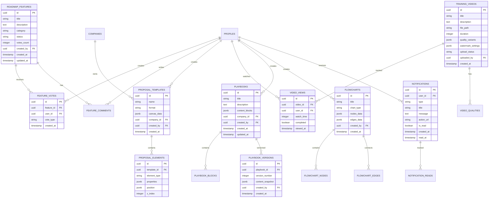

# ARQUITETURA TÉCNICA - FUNCIONALIDADES PENDENTES SOLARA

## 1. Architecture Design


## 2. Technology Description

- **Frontend**: React@18 + TypeScript@5 + Vite@5 + Tailwind CSS@3
- **State Management**: Zustand@4 + React Query@5
- **UI Components**: Radix UI + Shadcn/UI + Framer Motion@11
- **Canvas/Editor**: React Flow@11 + Fabric.js@5 + React DnD@16
- **Video Processing**: FFmpeg.wasm + HLS.js + Video.js
- **Backend**: Supabase (PostgreSQL + Storage + Auth + Realtime)
- **Deployment**: Vercel + Supabase Cloud

## 3. Route Definitions

| Route | Purpose |
|-------|----------|
| /dashboard | Dashboard home centralizado com métricas e KPIs |
| /roadmap | Sistema de votação e gerenciamento de funcionalidades |
| /proposals/editor | Editor drag-and-drop para criação de propostas |
| /proposals/templates | Gerenciamento de templates A4 e 16:9 |
| /training/upload | Sistema de upload VPS para vídeos |
| /training/videos | Player protegido com watermark |
| /playbooks/editor | Editor Notion-style para playbooks |
| /flowcharts/editor | Editor de fluxogramas e mind maps |
| /settings/profile | Configurações de perfil do usuário |
| /settings/financial | Configurações financeiras (acesso restrito) |
| /notifications | Centro de notificações e alertas |

## 4. API Definitions

### 4.1 Roadmap API

**Criar nova funcionalidade**
```
POST /api/roadmap/features
```

Request:
| Param Name | Param Type | isRequired | Description |
|------------|------------|------------|-------------|
| title | string | true | Título da funcionalidade |
| description | string | true | Descrição detalhada |
| category | string | true | Categoria (frontend, backend, design) |
| priority | string | false | Prioridade (low, medium, high) |

Response:
| Param Name | Param Type | Description |
|------------|------------|-------------|
| id | string | ID único da funcionalidade |
| status | string | Status inicial (voting) |
| votes_count | number | Contador de votos (0) |
| created_at | string | Data de criação |

**Votar em funcionalidade**
```
POST /api/roadmap/features/{id}/vote
```

Request:
| Param Name | Param Type | isRequired | Description |
|------------|------------|------------|-------------|
| vote_type | string | true | Tipo do voto (up, down) |

Response:
| Param Name | Param Type | Description |
|------------|------------|-------------|
| success | boolean | Status da operação |
| new_count | number | Novo total de votos |

### 4.2 Proposal Editor API

**Salvar template de proposta**
```
POST /api/proposals/templates
```

Request:
| Param Name | Param Type | isRequired | Description |
|------------|------------|------------|-------------|
| name | string | true | Nome do template |
| format | string | true | Formato (A4, 16:9) |
| canvas_data | object | true | Dados do canvas em JSON |
| elements | array | true | Array de elementos do canvas |

Response:
| Param Name | Param Type | Description |
|------------|------------|-------------|
| template_id | string | ID do template criado |
| preview_url | string | URL do preview |

### 4.3 Video Upload API

**Upload de vídeo**
```
POST /api/training/videos/upload
```

Request (multipart/form-data):
| Param Name | Param Type | isRequired | Description |
|------------|------------|------------|-------------|
| file | File | true | Arquivo de vídeo |
| title | string | true | Título do vídeo |
| description | string | false | Descrição |
| category | string | true | Categoria do treinamento |

Response:
| Param Name | Param Type | Description |
|------------|------------|-------------|
| upload_id | string | ID do upload |
| processing_status | string | Status do processamento |
| estimated_time | number | Tempo estimado em segundos |

**Gerar URL de streaming**
```
GET /api/training/videos/{id}/stream
```

Response:
| Param Name | Param Type | Description |
|------------|------------|-------------|
| stream_url | string | URL assinada para streaming |
| expires_at | string | Data de expiração |
| watermark_config | object | Configurações do watermark |

### 4.4 Notification API

**Enviar notificação**
```
POST /api/notifications/send
```

Request:
| Param Name | Param Type | isRequired | Description |
|------------|------------|------------|-------------|
| user_id | string | true | ID do usuário destinatário |
| type | string | true | Tipo (info, warning, success, error) |
| title | string | true | Título da notificação |
| message | string | true | Mensagem |
| action_url | string | false | URL de ação |

Response:
| Param Name | Param Type | Description |
|------------|------------|-------------|
| notification_id | string | ID da notificação |
| delivered | boolean | Status de entrega |

## 5. Server Architecture Diagram


## 6. Data Model

### 6.1 Data Model Definition



### 6.2 Data Definition Language

**Roadmap Features Table**
```sql
-- Tabela principal para funcionalidades do roadmap
CREATE TABLE roadmap_features (
    id UUID PRIMARY KEY DEFAULT gen_random_uuid(),
    title VARCHAR(255) NOT NULL,
    description TEXT,
    category VARCHAR(50) NOT NULL CHECK (category IN ('frontend', 'backend', 'design', 'infrastructure')),
    status VARCHAR(20) NOT NULL DEFAULT 'voting' CHECK (status IN ('voting', 'planned', 'in_progress', 'completed', 'cancelled')),
    priority VARCHAR(10) DEFAULT 'medium' CHECK (priority IN ('low', 'medium', 'high')),
    votes_count INTEGER DEFAULT 0,
    created_by UUID REFERENCES profiles(id) ON DELETE SET NULL,
    created_at TIMESTAMP WITH TIME ZONE DEFAULT NOW(),
    updated_at TIMESTAMP WITH TIME ZONE DEFAULT NOW()
);

-- Tabela de votos
CREATE TABLE feature_votes (
    id UUID PRIMARY KEY DEFAULT gen_random_uuid(),
    feature_id UUID REFERENCES roadmap_features(id) ON DELETE CASCADE,
    user_id UUID REFERENCES profiles(id) ON DELETE CASCADE,
    vote_type VARCHAR(10) NOT NULL CHECK (vote_type IN ('up', 'down')),
    created_at TIMESTAMP WITH TIME ZONE DEFAULT NOW(),
    UNIQUE(feature_id, user_id)
);

-- Índices para performance
CREATE INDEX idx_roadmap_features_status ON roadmap_features(status);
CREATE INDEX idx_roadmap_features_category ON roadmap_features(category);
CREATE INDEX idx_roadmap_features_votes ON roadmap_features(votes_count DESC);
CREATE INDEX idx_feature_votes_feature_id ON feature_votes(feature_id);
```

**Proposal Templates Table**
```sql
-- Tabela para templates de propostas
CREATE TABLE proposal_templates (
    id UUID PRIMARY KEY DEFAULT gen_random_uuid(),
    name VARCHAR(255) NOT NULL,
    format VARCHAR(10) NOT NULL CHECK (format IN ('A4', '16:9')),
    canvas_data JSONB NOT NULL DEFAULT '{}',
    thumbnail_url VARCHAR(500),
    is_public BOOLEAN DEFAULT false,
    company_id UUID REFERENCES companies(id) ON DELETE CASCADE,
    created_by UUID REFERENCES profiles(id) ON DELETE SET NULL,
    created_at TIMESTAMP WITH TIME ZONE DEFAULT NOW(),
    updated_at TIMESTAMP WITH TIME ZONE DEFAULT NOW()
);

-- Tabela para elementos do canvas
CREATE TABLE proposal_elements (
    id UUID PRIMARY KEY DEFAULT gen_random_uuid(),
    template_id UUID REFERENCES proposal_templates(id) ON DELETE CASCADE,
    element_type VARCHAR(50) NOT NULL CHECK (element_type IN ('text', 'image', 'chart', 'table', 'shape')),
    properties JSONB NOT NULL DEFAULT '{}',
    position JSONB NOT NULL DEFAULT '{"x": 0, "y": 0, "width": 100, "height": 100}',
    z_index INTEGER DEFAULT 0,
    created_at TIMESTAMP WITH TIME ZONE DEFAULT NOW()
);

-- Índices
CREATE INDEX idx_proposal_templates_company ON proposal_templates(company_id);
CREATE INDEX idx_proposal_templates_format ON proposal_templates(format);
CREATE INDEX idx_proposal_elements_template ON proposal_elements(template_id);
CREATE INDEX idx_proposal_elements_z_index ON proposal_elements(z_index);
```

**Training Videos Table**
```sql
-- Tabela para vídeos de treinamento
CREATE TABLE training_videos (
    id UUID PRIMARY KEY DEFAULT gen_random_uuid(),
    title VARCHAR(255) NOT NULL,
    description TEXT,
    file_path VARCHAR(500),
    original_filename VARCHAR(255),
    file_size BIGINT,
    duration INTEGER, -- em segundos
    quality_variants JSONB DEFAULT '[]',
    watermark_settings JSONB DEFAULT '{}',
    upload_status VARCHAR(20) DEFAULT 'uploading' CHECK (upload_status IN ('uploading', 'processing', 'ready', 'error')),
    category VARCHAR(50),
    tags TEXT[],
    is_public BOOLEAN DEFAULT false,
    uploaded_by UUID REFERENCES profiles(id) ON DELETE SET NULL,
    created_at TIMESTAMP WITH TIME ZONE DEFAULT NOW(),
    updated_at TIMESTAMP WITH TIME ZONE DEFAULT NOW()
);

-- Tabela para tracking de visualizações
CREATE TABLE video_views (
    id UUID PRIMARY KEY DEFAULT gen_random_uuid(),
    video_id UUID REFERENCES training_videos(id) ON DELETE CASCADE,
    user_id UUID REFERENCES profiles(id) ON DELETE CASCADE,
    watch_time INTEGER DEFAULT 0, -- tempo assistido em segundos
    total_duration INTEGER, -- duração total no momento da visualização
    completed BOOLEAN DEFAULT false,
    last_position INTEGER DEFAULT 0, -- última posição assistida
    viewed_at TIMESTAMP WITH TIME ZONE DEFAULT NOW(),
    completed_at TIMESTAMP WITH TIME ZONE
);

-- Índices
CREATE INDEX idx_training_videos_status ON training_videos(upload_status);
CREATE INDEX idx_training_videos_category ON training_videos(category);
CREATE INDEX idx_video_views_video_user ON video_views(video_id, user_id);
CREATE INDEX idx_video_views_completed ON video_views(completed);
```

**Playbooks Table**
```sql
-- Tabela para playbooks
CREATE TABLE playbooks (
    id UUID PRIMARY KEY DEFAULT gen_random_uuid(),
    title VARCHAR(255) NOT NULL,
    description TEXT,
    content_blocks JSONB DEFAULT '[]',
    cover_image VARCHAR(500),
    is_published BOOLEAN DEFAULT false,
    company_id UUID REFERENCES companies(id) ON DELETE CASCADE,
    created_by UUID REFERENCES profiles(id) ON DELETE SET NULL,
    created_at TIMESTAMP WITH TIME ZONE DEFAULT NOW(),
    updated_at TIMESTAMP WITH TIME ZONE DEFAULT NOW()
);

-- Tabela para versionamento
CREATE TABLE playbook_versions (
    id UUID PRIMARY KEY DEFAULT gen_random_uuid(),
    playbook_id UUID REFERENCES playbooks(id) ON DELETE CASCADE,
    version_number INTEGER NOT NULL,
    content_snapshot JSONB NOT NULL,
    change_summary TEXT,
    created_by UUID REFERENCES profiles(id) ON DELETE SET NULL,
    created_at TIMESTAMP WITH TIME ZONE DEFAULT NOW()
);

-- Índices
CREATE INDEX idx_playbooks_company ON playbooks(company_id);
CREATE INDEX idx_playbooks_published ON playbooks(is_published);
CREATE INDEX idx_playbook_versions_playbook ON playbook_versions(playbook_id);
CREATE UNIQUE INDEX idx_playbook_versions_unique ON playbook_versions(playbook_id, version_number);
```

**Flowcharts Table**
```sql
-- Tabela para fluxogramas
CREATE TABLE flowcharts (
    id UUID PRIMARY KEY DEFAULT gen_random_uuid(),
    title VARCHAR(255) NOT NULL,
    description TEXT,
    chart_type VARCHAR(50) DEFAULT 'flowchart' CHECK (chart_type IN ('flowchart', 'mindmap', 'diagram')),
    nodes_data JSONB DEFAULT '[]',
    edges_data JSONB DEFAULT '[]',
    layout_config JSONB DEFAULT '{}',
    is_public BOOLEAN DEFAULT false,
    created_by UUID REFERENCES profiles(id) ON DELETE SET NULL,
    created_at TIMESTAMP WITH TIME ZONE DEFAULT NOW(),
    updated_at TIMESTAMP WITH TIME ZONE DEFAULT NOW()
);

-- Índices
CREATE INDEX idx_flowcharts_type ON flowcharts(chart_type);
CREATE INDEX idx_flowcharts_creator ON flowcharts(created_by);
CREATE INDEX idx_flowcharts_public ON flowcharts(is_public);
```

**Notifications Table**
```sql
-- Tabela para notificações
CREATE TABLE notifications (
    id UUID PRIMARY KEY DEFAULT gen_random_uuid(),
    user_id UUID REFERENCES profiles(id) ON DELETE CASCADE,
    type VARCHAR(20) NOT NULL CHECK (type IN ('info', 'warning', 'success', 'error')),
    title VARCHAR(255) NOT NULL,
    message TEXT NOT NULL,
    action_url VARCHAR(500),
    action_label VARCHAR(100),
    is_read BOOLEAN DEFAULT false,
    is_push_sent BOOLEAN DEFAULT false,
    is_email_sent BOOLEAN DEFAULT false,
    created_at TIMESTAMP WITH TIME ZONE DEFAULT NOW(),
    read_at TIMESTAMP WITH TIME ZONE,
    expires_at TIMESTAMP WITH TIME ZONE
);

-- Índices
CREATE INDEX idx_notifications_user ON notifications(user_id);
CREATE INDEX idx_notifications_unread ON notifications(user_id, is_read) WHERE is_read = false;
CREATE INDEX idx_notifications_type ON notifications(type);
CREATE INDEX idx_notifications_created ON notifications(created_at DESC);
```

**Triggers e Functions**
```sql
-- Function para atualizar contador de votos
CREATE OR REPLACE FUNCTION update_feature_votes_count()
RETURNS TRIGGER AS $$
BEGIN
    IF TG_OP = 'INSERT' THEN
        UPDATE roadmap_features 
        SET votes_count = (
            SELECT COUNT(*) FROM feature_votes 
            WHERE feature_id = NEW.feature_id AND vote_type = 'up'
        ) - (
            SELECT COUNT(*) FROM feature_votes 
            WHERE feature_id = NEW.feature_id AND vote_type = 'down'
        )
        WHERE id = NEW.feature_id;
        RETURN NEW;
    ELSIF TG_OP = 'DELETE' THEN
        UPDATE roadmap_features 
        SET votes_count = (
            SELECT COUNT(*) FROM feature_votes 
            WHERE feature_id = OLD.feature_id AND vote_type = 'up'
        ) - (
            SELECT COUNT(*) FROM feature_votes 
            WHERE feature_id = OLD.feature_id AND vote_type = 'down'
        )
        WHERE id = OLD.feature_id;
        RETURN OLD;
    END IF;
    RETURN NULL;
END;
$$ LANGUAGE plpgsql;

-- Trigger para contador de votos
CREATE TRIGGER trigger_update_votes_count
    AFTER INSERT OR DELETE ON feature_votes
    FOR EACH ROW EXECUTE FUNCTION update_feature_votes_count();

-- Function para criar versão automática do playbook
CREATE OR REPLACE FUNCTION create_playbook_version()
RETURNS TRIGGER AS $$
BEGIN
    IF OLD.content_blocks IS DISTINCT FROM NEW.content_blocks THEN
        INSERT INTO playbook_versions (playbook_id, version_number, content_snapshot, created_by)
        VALUES (
            NEW.id,
            COALESCE((SELECT MAX(version_number) FROM playbook_versions WHERE playbook_id = NEW.id), 0) + 1,
            NEW.content_blocks,
            NEW.created_by
        );
    END IF;
    RETURN NEW;
END;
$$ LANGUAGE plpgsql;

-- Trigger para versionamento automático
CREATE TRIGGER trigger_create_playbook_version
    AFTER UPDATE ON playbooks
    FOR EACH ROW EXECUTE FUNCTION create_playbook_version();
```

**Row Level Security (RLS)**
```sql
-- Habilitar RLS nas tabelas
ALTER TABLE roadmap_features ENABLE ROW LEVEL SECURITY;
ALTER TABLE feature_votes ENABLE ROW LEVEL SECURITY;
ALTER TABLE proposal_templates ENABLE ROW LEVEL SECURITY;
ALTER TABLE training_videos ENABLE ROW LEVEL SECURITY;
ALTER TABLE playbooks ENABLE ROW LEVEL SECURITY;
ALTER TABLE flowcharts ENABLE ROW LEVEL SECURITY;
ALTER TABLE notifications ENABLE ROW LEVEL SECURITY;

-- Políticas para roadmap_features
CREATE POLICY "Roadmap features são visíveis para todos" ON roadmap_features
    FOR SELECT USING (true);

CREATE POLICY "Usuários autenticados podem criar features" ON roadmap_features
    FOR INSERT WITH CHECK (auth.role() = 'authenticated');

CREATE POLICY "Apenas admins podem atualizar status" ON roadmap_features
    FOR UPDATE USING (
        EXISTS (
            SELECT 1 FROM profiles 
            WHERE id = auth.uid() 
            AND access_type IN ('admin', 'super_admin')
        )
    );

-- Políticas para feature_votes
CREATE POLICY "Votos são visíveis para todos" ON feature_votes
    FOR SELECT USING (true);

CREATE POLICY "Usuários podem votar" ON feature_votes
    FOR INSERT WITH CHECK (auth.uid() = user_id);

CREATE POLICY "Usuários podem alterar seus votos" ON feature_votes
    FOR UPDATE USING (auth.uid() = user_id);

-- Políticas para proposal_templates
CREATE POLICY "Templates da empresa são visíveis" ON proposal_templates
    FOR SELECT USING (
        company_id = (
            SELECT company_id FROM profiles WHERE id = auth.uid()
        ) OR is_public = true
    );

CREATE POLICY "Usuários podem criar templates" ON proposal_templates
    FOR INSERT WITH CHECK (
        company_id = (
            SELECT company_id FROM profiles WHERE id = auth.uid()
        )
    );

-- Políticas para notifications
CREATE POLICY "Usuários veem apenas suas notificações" ON notifications
    FOR ALL USING (auth.uid() = user_id);
```

**Dados Iniciais**
```sql
-- Inserir categorias padrão para roadmap
INSERT INTO roadmap_features (title, description, category, status, priority) VALUES
('Editor Drag-and-Drop para Propostas', 'Implementar editor visual com canvas infinito para criação de propostas', 'frontend', 'planned', 'high'),
('Sistema de Upload VPS', 'Sistema próprio de hospedagem e streaming de vídeos com watermark', 'infrastructure', 'planned', 'high'),
('Dashboard Home Centralizado', 'Página inicial com métricas, KPIs e visão geral da plataforma', 'frontend', 'planned', 'medium'),
('Editor de Playbooks Notion-style', 'Editor rico para criação de playbooks com blocos modulares', 'frontend', 'voting', 'medium'),
('Sistema de Notificações Push', 'Notificações em tempo real e centro de mensagens', 'backend', 'voting', 'low');

-- Inserir templates padrão
INSERT INTO proposal_templates (name, format, canvas_data, is_public) VALUES
('Template Residencial A4', 'A4', '{"background": "#ffffff", "elements": []}', true),
('Template Comercial 16:9', '16:9', '{"background": "#f8f9fa", "elements": []}', true),
('Template Minimalista A4', 'A4', '{"background": "#ffffff", "grid": true}', true);
```

---

**Esta arquitetura técnica fornece a base sólida para implementação das funcionalidades pendentes, garantindo escalabilidade, performance e segurança adequadas para o crescimento da plataforma Solara Nova Energia.**