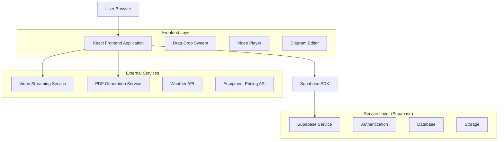
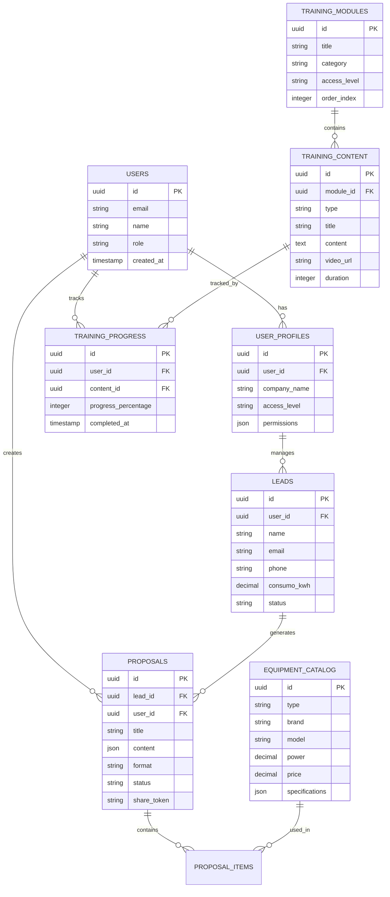

# ARQUITETURA TÉCNICA - SOLARA NOVA ENERGIA 2025
## Especificações Técnicas e Roadmap de Implementação

## 1. Architecture Design



## 2. Technology Description

- **Frontend**: React@18 + TypeScript + Tailwind CSS + Vite
- **Backend**: Supabase (PostgreSQL + Auth + Storage)
- **Video Streaming**: VPS própria com HLS e proteção contra download
- **PDF Generation**: jsPDF + html2canvas
- **Drag-Drop**: @dnd-kit/core + @dnd-kit/sortable
- **Diagrams**: React Flow + D3.js
- **Charts**: Recharts + Chart.js
- **Animations**: Framer Motion

## 3. Route Definitions

| Route | Purpose |
|-------|----------|
| / | Dashboard principal com métricas e acesso rápido |
| /solar | Módulo fotovoltaico com calculadora e análise financeira |
| /training | Dashboard de treinamentos com progresso e módulos |
| /training/:moduleId | Página detalhada do módulo com conteúdo |
| /training/video/:videoId | Player de vídeo com controles avançados |
| /training/playbook/:playbookId | Editor/visualizador de playbooks |
| /training/diagram/:diagramId | Editor de fluxogramas e mind maps |
| /proposals | Lista de propostas com filtros e busca |
| /proposals/editor | Editor drag-and-drop de propostas |
| /proposals/templates | Galeria de templates com preview |
| /proposals/:proposalId | Visualização/edição de proposta específica |
| /leads | Gestão de leads com pipeline de vendas |
| /equipment | Biblioteca de equipamentos com comparador |
| /reports | Dashboards e relatórios analíticos |
| /settings | Configurações de usuário e empresa |

## 4. API Definitions

### 4.1 Core API - Módulo Fotovoltaico

**Cálculo de Dimensionamento**
```
POST /api/solar/calculate
```

Request:
| Param Name | Param Type | isRequired | Description |
|------------|------------|------------|-------------|
| consumo_kwh | number | true | Consumo mensal em kWh |
| localizacao | object | true | Coordenadas e dados de irradiação |
| tipo_telhado | string | true | Tipo e orientação do telhado |
| concessionaria | string | true | Concessionária de energia local |

Response:
| Param Name | Param Type | Description |
|------------|------------|-------------|
| potencia_sistema | number | Potência recomendada em kWp |
| numero_modulos | number | Quantidade de módulos solares |
| area_necessaria | number | Área mínima em m² |
| geracao_mensal | number | Geração estimada mensal |
| economia_anual | number | Economia anual estimada |

### 4.2 Core API - Módulo de Treinamento

**Upload de Vídeo**
```
POST /api/training/videos/upload
```

Request:
| Param Name | Param Type | isRequired | Description |
|------------|------------|------------|-------------|
| file | File | true | Arquivo de vídeo (MP4, MOV, AVI) |
| title | string | true | Título do vídeo |
| description | string | false | Descrição do conteúdo |
| category | string | true | Categoria de acesso (comercial, engenharia, instalacao) |
| module_id | string | true | ID do módulo de treinamento |

Response:
| Param Name | Param Type | Description |
|------------|------------|-------------|
| video_id | string | ID único do vídeo |
| streaming_url | string | URL segura para streaming |
| thumbnail_url | string | URL da miniatura gerada |
| duration | number | Duração em segundos |
| status | string | Status do processamento |

### 4.3 Core API - Editor de Propostas

**Salvar Proposta**
```
POST /api/proposals/save
```

Request:
| Param Name | Param Type | isRequired | Description |
|------------|------------|------------|-------------|
| title | string | true | Título da proposta |
| lead_id | string | true | ID do lead/cliente |
| template_id | string | false | ID do template utilizado |
| content | object | true | Estrutura JSON do conteúdo |
| format | string | true | Formato (A4 ou 16:9) |

Response:
| Param Name | Param Type | Description |
|------------|------------|-------------|
| proposal_id | string | ID único da proposta |
| share_url | string | URL pública para compartilhamento |
| pdf_url | string | URL do PDF gerado |
| created_at | string | Data de criação |

## 5. Data Model

### 5.1 Data Model Definition



### 5.2 Data Definition Language

**Tabela de Módulos de Treinamento**
```sql
-- Criar tabela de módulos
CREATE TABLE training_modules (
    id UUID PRIMARY KEY DEFAULT gen_random_uuid(),
    title VARCHAR(255) NOT NULL,
    description TEXT,
    category VARCHAR(50) NOT NULL CHECK (category IN ('comercial', 'engenharia', 'instalacao', 'geral')),
    access_level VARCHAR(50) NOT NULL CHECK (access_level IN ('basico', 'intermediario', 'avancado')),
    order_index INTEGER DEFAULT 0,
    is_active BOOLEAN DEFAULT true,
    created_at TIMESTAMP WITH TIME ZONE DEFAULT NOW(),
    updated_at TIMESTAMP WITH TIME ZONE DEFAULT NOW()
);

-- Criar tabela de conteúdo de treinamento
CREATE TABLE training_content (
    id UUID PRIMARY KEY DEFAULT gen_random_uuid(),
    module_id UUID REFERENCES training_modules(id) ON DELETE CASCADE,
    type VARCHAR(50) NOT NULL CHECK (type IN ('video', 'playbook', 'diagram', 'assessment', 'document')),
    title VARCHAR(255) NOT NULL,
    content TEXT,
    video_url VARCHAR(500),
    thumbnail_url VARCHAR(500),
    duration INTEGER DEFAULT 0,
    order_index INTEGER DEFAULT 0,
    is_required BOOLEAN DEFAULT false,
    created_at TIMESTAMP WITH TIME ZONE DEFAULT NOW(),
    updated_at TIMESTAMP WITH TIME ZONE DEFAULT NOW()
);

-- Criar tabela de progresso do usuário
CREATE TABLE user_training_progress (
    id UUID PRIMARY KEY DEFAULT gen_random_uuid(),
    user_id UUID REFERENCES auth.users(id) ON DELETE CASCADE,
    content_id UUID REFERENCES training_content(id) ON DELETE CASCADE,
    progress_percentage INTEGER DEFAULT 0 CHECK (progress_percentage >= 0 AND progress_percentage <= 100),
    time_spent INTEGER DEFAULT 0,
    completed_at TIMESTAMP WITH TIME ZONE,
    last_accessed TIMESTAMP WITH TIME ZONE DEFAULT NOW(),
    created_at TIMESTAMP WITH TIME ZONE DEFAULT NOW(),
    UNIQUE(user_id, content_id)
);

-- Criar índices para performance
CREATE INDEX idx_training_content_module_id ON training_content(module_id);
CREATE INDEX idx_training_content_type ON training_content(type);
CREATE INDEX idx_user_progress_user_id ON user_training_progress(user_id);
CREATE INDEX idx_user_progress_content_id ON user_training_progress(content_id);

-- Dados iniciais
INSERT INTO training_modules (title, description, category, access_level, order_index) VALUES
('Fundamentos da Energia Solar', 'Conceitos básicos sobre energia fotovoltaica', 'geral', 'basico', 1),
('Técnicas de Vendas Solar', 'Estratégias comerciais para energia solar', 'comercial', 'intermediario', 2),
('Dimensionamento de Sistemas', 'Cálculos técnicos e dimensionamento', 'engenharia', 'avancado', 3),
('Instalação e Manutenção', 'Procedimentos de instalação segura', 'instalacao', 'intermediario', 4);
```

**Tabela de Propostas Avançadas**
```sql
-- Criar tabela de propostas
CREATE TABLE proposals (
    id UUID PRIMARY KEY DEFAULT gen_random_uuid(),
    lead_id UUID REFERENCES leads(id) ON DELETE CASCADE,
    user_id UUID REFERENCES auth.users(id) ON DELETE SET NULL,
    title VARCHAR(255) NOT NULL,
    content JSONB NOT NULL DEFAULT '{}',
    format VARCHAR(10) NOT NULL CHECK (format IN ('A4', '16:9')),
    template_id UUID,
    status VARCHAR(50) DEFAULT 'draft' CHECK (status IN ('draft', 'sent', 'viewed', 'accepted', 'rejected')),
    share_token VARCHAR(100) UNIQUE,
    pdf_url VARCHAR(500),
    view_count INTEGER DEFAULT 0,
    last_viewed TIMESTAMP WITH TIME ZONE,
    expires_at TIMESTAMP WITH TIME ZONE,
    created_at TIMESTAMP WITH TIME ZONE DEFAULT NOW(),
    updated_at TIMESTAMP WITH TIME ZONE DEFAULT NOW()
);

-- Criar tabela de templates
CREATE TABLE proposal_templates (
    id UUID PRIMARY KEY DEFAULT gen_random_uuid(),
    name VARCHAR(255) NOT NULL,
    description TEXT,
    format VARCHAR(10) NOT NULL CHECK (format IN ('A4', '16:9')),
    content JSONB NOT NULL DEFAULT '{}',
    thumbnail_url VARCHAR(500),
    is_public BOOLEAN DEFAULT false,
    created_by UUID REFERENCES auth.users(id),
    created_at TIMESTAMP WITH TIME ZONE DEFAULT NOW()
);

-- Função para gerar token de compartilhamento
CREATE OR REPLACE FUNCTION generate_share_token()
RETURNS TEXT AS $$
BEGIN
    RETURN encode(gen_random_bytes(32), 'base64url');
END;
$$ LANGUAGE plpgsql;

-- Trigger para gerar token automaticamente
CREATE OR REPLACE FUNCTION set_share_token()
RETURNS TRIGGER AS $$
BEGIN
    IF NEW.share_token IS NULL THEN
        NEW.share_token := generate_share_token();
    END IF;
    RETURN NEW;
END;
$$ LANGUAGE plpgsql;

CREATE TRIGGER trigger_set_share_token
    BEFORE INSERT ON proposals
    FOR EACH ROW
    EXECUTE FUNCTION set_share_token();
```

## 6. Melhorias de Performance Identificadas

### 6.1 Frontend Optimizations

1. **Code Splitting**: Implementar lazy loading para módulos grandes
2. **Bundle Optimization**: Reduzir tamanho do bundle principal de ~2MB para <500KB
3. **Image Optimization**: Implementar WebP com fallback, lazy loading de imagens
4. **Caching Strategy**: Service Worker para cache de assets estáticos
5. **Virtual Scrolling**: Para listas grandes de equipamentos e leads

### 6.2 Backend Optimizations

1. **Database Indexing**: Índices compostos para queries complexas
2. **Query Optimization**: Reduzir N+1 queries com joins eficientes
3. **Caching Layer**: Redis para cache de cálculos frequentes
4. **Video Security**: VPS própria com streaming protegido e autenticação por token
5. **Connection Pooling**: Otimizar conexões com Supabase

### 6.3 Video Streaming Optimizations

1. **Adaptive Bitrate**: HLS com múltiplas qualidades
2. **Progressive Download**: Início de reprodução antes do download completo
3. **Thumbnail Generation**: Miniaturas automáticas em múltiplos pontos
4. **Watermark Overlay**: Proteção dinâmica baseada no usuário
5. **Analytics Integration**: Tracking detalhado de visualizações

## 7. Roadmap de Implementação

### Fase 1 - Estruturação e Performance (4 semanas)
- ✅ Reorganização da estrutura de pastas
- ✅ Implementação de code splitting
- ✅ Otimização de bundle e assets
- ⌛ Configuração de CDN para vídeos
- ⌛ Implementação de caching strategy

### Fase 2 - Módulo de Treinamento Avançado (6 semanas)
- ⌛ Sistema de upload de vídeos em VPS própria com proteção avançada
- ⌛ Editor de playbooks estilo Notion
- ⌛ Editor de fluxogramas com React Flow
- ⌛ Sistema de avaliações e certificação
- ⌛ Dashboard de progresso avançado

### Fase 3 - Editor de Propostas Drag-and-Drop (4 semanas)
- ⌛ Canvas infinito com zoom e pan
- ⌛ Biblioteca de elementos visuais
- ⌛ Sistema de templates A4/16:9
- ⌛ Animações e transições
- ⌛ Export para PDF de alta qualidade

### Fase 4 - Melhorias Visuais e UX (3 semanas)
- ⌛ Design system completo
- ⌛ Animações micro-interações
- ⌛ Responsividade mobile
- ⌛ Temas claro/escuro
- ⌛ Acessibilidade WCAG 2.1

### Fase 5 - Integrações e Analytics (3 semanas)
- ⌛ API de preços de equipamentos
- ⌛ Integração com CRM externo
- ⌛ Dashboard de analytics avançado
- ⌛ Relatórios automatizados
- ⌛ Backup e recuperação

**Total estimado: 20 semanas (5 meses)**
**Recursos necessários: 2-3 desenvolvedores full-stack**
**Investimento estimado: R$ 150.000 - R$ 200.000**