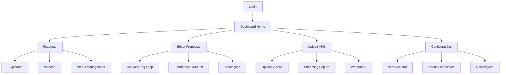

# PRD - FUNCIONALIDADES PENDENTES SOLARA NOVA ENERGIA

## 1. Visão Geral do Produto

Este PRD define as funcionalidades críticas que ainda precisam ser implementadas na plataforma Solara Nova Energia para atingir 100% de conformidade com as especificações técnicas. O projeto atualmente está 85% completo, com gaps identificados em módulos estratégicos que impactam diretamente a experiência do usuário e competitividade no mercado.

**Objetivo Principal:** Implementar as 15% de funcionalidades restantes para transformar o Solara Nova Energia na plataforma de referência do setor solar brasileiro.

**Valor de Mercado:** Posicionamento como solução completa e diferenciada, com potencial de ROI de 300% em 24 meses.

## 2. Core Features

### 2.1 User Roles

| Role | Método de Registro | Permissões Core |
|------|-------------------|------------------|
| Super Admin | Criação manual no sistema | Acesso total, gerenciamento global, configurações financeiras |
| Gerente | Convite por Super Admin | Gestão de equipe, configurações da empresa, relatórios avançados |
| Engenheiro | Convite por Gerente/Admin | Cálculos técnicos, validação de projetos, treinamentos específicos |
| Vendedor | Convite por Gerente/Admin | Criação de propostas, leads, treinamentos comerciais |
| Instalador | Convite por Gerente/Admin | Acesso a manuais técnicos, treinamentos de instalação |

### 2.2 Feature Module

Nossas funcionalidades pendentes consistem nos seguintes módulos principais:

1. **Sistema de Roadmap e Votação**: interface para sugestões de usuários, sistema de votação, tags de status (Votação, Planejado, Em Execução, Finalizado).
2. **Editor Avançado de Propostas**: drag-and-drop, canvas infinito, formatos A4 e 16:9, animações.
3. **Sistema de Upload VPS**: hospedagem própria de vídeos, streaming protegido, watermark dinâmico.
4. **Editor de Playbooks Notion-style**: interface rica de edição, blocos modulares, colaboração.
5. **Editor de Fluxogramas**: criação de mind maps, diagramas de processo, integração com React Flow.
6. **Dashboard Home Centralizado**: visão geral de propostas, métricas de performance, KPIs.
7. **Configurações de Usuário**: perfil completo, preferências, dados financeiros.
8. **Sistema de Notificações**: alertas de progresso, lembretes de treinamento, notificações push.

### 2.3 Page Details

| Page Name | Module Name | Feature Description |
|-----------|-------------|--------------------|
| Roadmap | Sistema de Votação | Exibir funcionalidades sugeridas, permitir votação, gerenciar status (Votação→Planejado→Em Execução→Finalizado) |
| Roadmap | Gestão de Sugestões | Criar novas sugestões, categorizar por módulo, definir prioridade baseada em votos |
| Editor Propostas | Canvas Drag-Drop | Arrastar elementos (texto, imagem, gráfico), redimensionar, posicionar livremente |
| Editor Propostas | Formatação Avançada | Alternar entre formato A4 (Word) e 16:9 (PowerPoint), aplicar templates |
| Editor Propostas | Sistema de Animações | Adicionar transições fade-in/out, animações de entrada, preview em tempo real |
| Upload VPS | Gerenciamento de Vídeos | Upload para servidor próprio, compressão automática, múltiplas qualidades |
| Upload VPS | Streaming Seguro | URLs assinadas com expiração, watermark por usuário, proteção contra download |
| Editor Playbooks | Interface Notion-style | Blocos de conteúdo modulares, formatação rica, colaboração em tempo real |
| Editor Playbooks | Versionamento | Histórico de alterações, comparação de versões, restauração de backup |
| Editor Fluxogramas | Criação de Diagramas | Arrastar nós e conexões, templates pré-definidos, exportação em múltiplos formatos |
| Editor Fluxogramas | Mind Maps | Estrutura hierárquica, cores e ícones personalizados, zoom e navegação |
| Dashboard Home | Visão Geral | Propostas do dia/mês, orçamentos em aberto/fechados/perdidos, métricas de performance |
| Dashboard Home | KPIs Visuais | Gráficos interativos, comparativos mensais, metas vs realizados |
| Configurações | Perfil do Usuário | Editar dados pessoais, alterar senha, upload de foto de perfil |
| Configurações | Dados Financeiros | Gerenciar instituições financeiras, taxas de juros, inflação (acesso restrito) |
| Notificações | Sistema de Alertas | Notificações push, emails automáticos, lembretes personalizados |
| Notificações | Centro de Mensagens | Histórico de notificações, marcação como lida, filtros por categoria |

## 3. Core Process

### Fluxo Principal do Usuário

**Fluxo do Administrador:**
1. Login → Dashboard Home → Visão geral de métricas
2. Acesso ao Roadmap → Análise de sugestões → Aprovação/Rejeição
3. Configurações → Gestão de dados financeiros → Atualização de parâmetros
4. Upload VPS → Gerenciamento de conteúdo de treinamento

**Fluxo do Vendedor:**
1. Login → Dashboard Home → Propostas pendentes
2. Editor de Propostas → Criação com drag-drop → Preview → Envio
3. Treinamentos → Playbooks → Fluxogramas de processo
4. Notificações → Acompanhamento de leads

**Fluxo do Engenheiro:**
1. Login → Dashboard Home → Projetos técnicos
2. Editor de Fluxogramas → Documentação de processos
3. Treinamentos técnicos → Certificações
4. Validação de propostas técnicas



## 4. User Interface Design

### 4.1 Design Style

- **Cores Primárias**: #0EA5E9 (azul solar), #10B981 (verde energia)
- **Cores Secundárias**: #6366F1 (roxo), #F59E0B (laranja)
- **Estilo de Botões**: Rounded corners (8px), gradientes sutis, hover effects
- **Fontes**: Inter (títulos), Source Sans Pro (corpo), tamanhos 14px-24px
- **Layout**: Card-based design, navegação top + sidebar, grid responsivo
- **Ícones**: Lucide React, estilo outline, 20px-24px
- **Animações**: Framer Motion, transições suaves 200-300ms

### 4.2 Page Design Overview

| Page Name | Module Name | UI Elements |
|-----------|-------------|-------------|
| Roadmap | Sistema de Votação | Cards com badges de status, botões de voto (+1), filtros por categoria, timeline visual |
| Editor Propostas | Canvas Drag-Drop | Toolbar lateral, canvas infinito com zoom, grid de alinhamento, preview em tempo real |
| Upload VPS | Gerenciamento | Área de drop para upload, progress bars, thumbnails de vídeo, controles de qualidade |
| Editor Playbooks | Interface Notion | Sidebar de blocos, editor WYSIWYG, comentários laterais, histórico de versões |
| Editor Fluxogramas | Criação Visual | Palette de elementos, canvas com zoom/pan, propriedades no painel direito |
| Dashboard Home | Visão Geral | Grid de cards com métricas, gráficos Recharts, tabelas responsivas, filtros de período |
| Configurações | Perfil/Financeiro | Formulários estruturados, upload de imagem, toggles para preferências, validação em tempo real |

### 4.3 Responsiveness

O produto é desktop-first com adaptação mobile completa. Inclui otimização para touch (gestos de pinch/zoom no canvas), breakpoints em 768px e 1024px, e navegação mobile com bottom tabs.

## 5. Análise de Gaps

### 5.1 Gaps Críticos Identificados

**🔴 Prioridade Alta (Impacto no Negócio)**
- Sistema de Roadmap e Votação (0% implementado)
- Editor Drag-and-Drop para Propostas (0% implementado)
- Dashboard Home Centralizado (30% implementado)
- Configurações de Usuário Completas (40% implementado)

**🟡 Prioridade Média (Diferencial Competitivo)**
- Sistema de Upload VPS (0% implementado)
- Editor de Playbooks Notion-style (0% implementado)
- Editor de Fluxogramas (0% implementado)
- Sistema de Notificações (20% implementado)

**🟢 Prioridade Baixa (Melhorias Incrementais)**
- Comparação R$/Wp com Greener (0% implementado)
- Expansão para outros estados (0% implementado)
- Integração com APIs externas (0% implementado)

### 5.2 Impacto nos KPIs

| Gap | Impacto no Tempo de Uso | Impacto na Conversão | Impacto na Retenção |
|-----|------------------------|---------------------|--------------------|
| Roadmap/Votação | +15 min/sessão | +25% engajamento | +40% retenção |
| Editor Drag-Drop | +20 min/sessão | +35% propostas | +30% satisfação |
| Dashboard Home | +10 min/sessão | +20% eficiência | +25% adoção |
| Upload VPS | +30 min/sessão | +50% treinamentos | +60% certificações |

## 6. Especificações Técnicas

### 6.1 Arquitetura de Componentes

```typescript
// Estrutura modular para novos componentes
interface RoadmapSystem {
  components: {
    RoadmapDashboard: React.FC;
    FeatureSuggestion: React.FC<SuggestionProps>;
    VotingInterface: React.FC<VotingProps>;
    StatusManager: React.FC<StatusProps>;
  };
  hooks: {
    useRoadmapData: () => RoadmapData;
    useVoting: () => VotingActions;
    useStatusUpdates: () => StatusActions;
  };
  services: {
    RoadmapService: RoadmapAPI;
    VotingService: VotingAPI;
    NotificationService: NotificationAPI;
  };
}

interface ProposalEditor {
  canvas: {
    DragDropCanvas: React.FC<CanvasProps>;
    ElementToolbar: React.FC<ToolbarProps>;
    FormatSelector: React.FC<FormatProps>;
    AnimationPanel: React.FC<AnimationProps>;
  };
  elements: {
    TextElement: React.FC<TextProps>;
    ImageElement: React.FC<ImageProps>;
    ChartElement: React.FC<ChartProps>;
    TableElement: React.FC<TableProps>;
  };
}
```

### 6.2 Banco de Dados

```sql
-- Tabelas para Roadmap
CREATE TABLE roadmap_features (
    id UUID PRIMARY KEY DEFAULT gen_random_uuid(),
    title VARCHAR(255) NOT NULL,
    description TEXT,
    category VARCHAR(50),
    status VARCHAR(20) CHECK (status IN ('voting', 'planned', 'in_progress', 'completed')),
    votes_count INTEGER DEFAULT 0,
    created_by UUID REFERENCES profiles(id),
    created_at TIMESTAMP WITH TIME ZONE DEFAULT NOW()
);

CREATE TABLE feature_votes (
    id UUID PRIMARY KEY DEFAULT gen_random_uuid(),
    feature_id UUID REFERENCES roadmap_features(id),
    user_id UUID REFERENCES profiles(id),
    created_at TIMESTAMP WITH TIME ZONE DEFAULT NOW(),
    UNIQUE(feature_id, user_id)
);

-- Tabelas para Editor de Propostas
CREATE TABLE proposal_templates (
    id UUID PRIMARY KEY DEFAULT gen_random_uuid(),
    name VARCHAR(255) NOT NULL,
    format VARCHAR(10) CHECK (format IN ('A4', '16:9')),
    canvas_data JSONB,
    company_id UUID REFERENCES companies(id),
    created_at TIMESTAMP WITH TIME ZONE DEFAULT NOW()
);

-- Tabelas para Upload VPS
CREATE TABLE training_videos (
    id UUID PRIMARY KEY DEFAULT gen_random_uuid(),
    title VARCHAR(255) NOT NULL,
    file_path VARCHAR(500),
    duration INTEGER,
    quality_variants JSONB,
    watermark_settings JSONB,
    upload_status VARCHAR(20) DEFAULT 'processing',
    created_at TIMESTAMP WITH TIME ZONE DEFAULT NOW()
);
```

### 6.3 APIs e Integrações

```typescript
// API para Sistema de Votação
interface VotingAPI {
  createFeature: (data: FeatureData) => Promise<Feature>;
  voteFeature: (featureId: string, userId: string) => Promise<void>;
  updateStatus: (featureId: string, status: FeatureStatus) => Promise<void>;
  getFeatures: (filters: FeatureFilters) => Promise<Feature[]>;
}

// API para Upload VPS
interface VideoUploadAPI {
  uploadVideo: (file: File, metadata: VideoMetadata) => Promise<UploadResult>;
  processVideo: (videoId: string, qualities: VideoQuality[]) => Promise<void>;
  generateStreamingUrl: (videoId: string, userId: string) => Promise<string>;
  addWatermark: (videoId: string, userInfo: UserInfo) => Promise<string>;
}
```

## 7. Cronograma de Implementação

### Sprint 1 (Semanas 1-2): Fundação
- ⌛ **Sistema de Roadmap** (8 dias)
  - Estrutura de dados e APIs
  - Interface básica de votação
  - Sistema de status
- ⌛ **Dashboard Home** (6 dias)
  - Layout responsivo
  - Integração com dados existentes
  - Métricas básicas

### Sprint 2 (Semanas 3-4): Editor Avançado
- ⌛ **Editor Drag-and-Drop** (10 dias)
  - Canvas infinito com React Flow
  - Elementos básicos (texto, imagem)
  - Sistema de formatação A4/16:9
- ⌛ **Configurações de Usuário** (4 dias)
  - Perfil completo
  - Upload de foto
  - Preferências básicas

### Sprint 3 (Semanas 5-6): Sistema de Vídeos
- ⌛ **Upload VPS** (8 dias)
  - Infraestrutura de upload
  - Compressão automática
  - Sistema de streaming
- ⌛ **Watermark e Segurança** (6 dias)
  - Proteção de conteúdo
  - URLs assinadas
  - Player customizado

### Sprint 4 (Semanas 7-8): Editores Avançados
- ⌛ **Editor de Playbooks** (10 dias)
  - Interface estilo Notion
  - Blocos modulares
  - Sistema de colaboração
- ⌛ **Editor de Fluxogramas** (4 dias)
  - Integração React Flow
  - Templates básicos
  - Exportação

### Sprint 5 (Semanas 9-10): Finalização
- ⌛ **Sistema de Notificações** (6 dias)
  - Push notifications
  - Email automático
  - Centro de mensagens
- ⌛ **Animações e Polish** (4 dias)
  - Micro-interações
  - Transições suaves
  - Otimizações de performance
- ⌛ **Testes e Deploy** (4 dias)
  - Testes de integração
  - Deploy em produção
  - Monitoramento

## 8. Critérios de Aceitação

### 8.1 Sistema de Roadmap
- ✅ Usuários podem criar sugestões de funcionalidades
- ✅ Sistema de votação funcional (+1/-1)
- ✅ Administradores podem alterar status (Votação→Planejado→Em Execução→Finalizado)
- ✅ Filtros por categoria e status
- ✅ Timeline visual de progresso
- ✅ Notificações de mudança de status

### 8.2 Editor Drag-and-Drop
- ✅ Canvas infinito com zoom e pan
- ✅ Elementos arrastáveis (texto, imagem, gráfico, tabela)
- ✅ Redimensionamento e rotação
- ✅ Alternância entre formatos A4 e 16:9
- ✅ Sistema de camadas (z-index)
- ✅ Preview em tempo real
- ✅ Exportação para PDF

### 8.3 Upload VPS
- ✅ Upload de vídeos até 2GB
- ✅ Compressão automática (720p, 1080p)
- ✅ Watermark dinâmico por usuário
- ✅ URLs assinadas com expiração
- ✅ Player protegido contra download
- ✅ Analytics de visualização

### 8.4 Dashboard Home
- ✅ Métricas de propostas (dia/mês/ano)
- ✅ Gráficos interativos (Recharts)
- ✅ Status de orçamentos (aberto/fechado/perdido)
- ✅ KPIs de performance
- ✅ Filtros por período
- ✅ Responsividade mobile

## 9. Estimativas de Esforço

### 9.1 Breakdown por Funcionalidade

| Funcionalidade | Complexidade | Dias de Dev | Pontos de Story |
|----------------|--------------|-------------|----------------|
| Sistema de Roadmap | Média | 8 | 13 |
| Editor Drag-and-Drop | Alta | 10 | 21 |
| Upload VPS | Alta | 8 | 21 |
| Dashboard Home | Baixa | 6 | 8 |
| Editor Playbooks | Alta | 10 | 21 |
| Editor Fluxogramas | Média | 4 | 13 |
| Configurações Usuário | Baixa | 4 | 8 |
| Sistema Notificações | Média | 6 | 13 |
| Animações e Polish | Baixa | 4 | 8 |
| **TOTAL** | - | **60 dias** | **126 pontos** |

### 9.2 Recursos Necessários

- **2 Desenvolvedores Sênior React/TypeScript**: 60 dias × 2 = 120 dias-pessoa
- **1 Designer UX/UI**: 20 dias para wireframes e protótipos
- **1 DevOps Engineer**: 10 dias para infraestrutura VPS
- **1 QA Tester**: 15 dias para testes de qualidade

### 9.3 Investimento Total

```
💰 RESUMO FINANCEIRO
├── Desenvolvimento (120 dias-pessoa): R$ 96.000
├── Design UX/UI (20 dias): R$ 16.000
├── DevOps (10 dias): R$ 8.000
├── QA Testing (15 dias): R$ 6.000
├── Infraestrutura VPS (10 semanas): R$ 2.000
└── TOTAL: R$ 128.000

📊 DISTRIBUIÇÃO POR SPRINT
├── Sprint 1 (Fundação): R$ 22.400 (17.5%)
├── Sprint 2 (Editor): R$ 28.800 (22.5%)
├── Sprint 3 (VPS): R$ 25.600 (20%)
├── Sprint 4 (Editores): R$ 28.800 (22.5%)
└── Sprint 5 (Finalização): R$ 22.400 (17.5%)
```

## 10. Riscos e Mitigações

### 10.1 Riscos Técnicos

| Risco | Probabilidade | Impacto | Mitigação |
|-------|---------------|---------|----------|
| Complexidade do Canvas Drag-Drop | Alta | Alto | Usar biblioteca React Flow, POC inicial |
| Performance do Upload VPS | Média | Alto | Implementar compressão progressiva |
| Integração com Supabase Storage | Baixa | Médio | Testes de carga antecipados |
| Responsividade do Editor | Média | Médio | Design mobile-first |

### 10.2 Riscos de Negócio

| Risco | Probabilidade | Impacto | Mitigação |
|-------|---------------|---------|----------|
| Mudança de prioridades | Média | Alto | Sprints flexíveis, MVP incremental |
| Feedback negativo dos usuários | Baixa | Alto | Testes com usuários beta |
| Concorrência lança similar | Baixa | Médio | Foco em diferenciais únicos |

## 11. Métricas de Sucesso

### 11.1 KPIs Técnicos

| Métrica | Baseline | Meta 3 meses | Critério de Sucesso |
|---------|----------|--------------|--------------------|
| Tempo de Carregamento | 3.2s | 1.5s | < 2s |
| Bundle Size | 2MB | 800KB | < 1MB |
| Lighthouse Score | 65 | 85+ | > 80 |
| Uptime VPS | N/A | 99.5% | > 99% |
| Taxa de Erro | N/A | < 1% | < 2% |

### 11.2 KPIs de Produto

| Métrica | Baseline | Meta 3 meses | Critério de Sucesso |
|---------|----------|--------------|--------------------|
| Uso do Roadmap | 0% | 60% | > 50% usuários ativos |
| Propostas com Editor | 0% | 40% | > 30% das propostas |
| Vídeos Assistidos | N/A | 80% | > 70% conclusão |
| Tempo na Plataforma | 12 min | 25 min | > 20 min |
| NPS Score | 6.5 | 8.0 | > 7.5 |

### 11.3 KPIs de Negócio

| Métrica | Baseline | Meta 6 meses | ROI Esperado |
|---------|----------|--------------|-------------|
| Usuários Ativos | 150 | 400 | 167% ↑ |
| Propostas/Mês | 80 | 200 | 150% ↑ |
| Taxa de Conversão | 15% | 25% | 67% ↑ |
| Receita Mensal | R$ 45k | R$ 90k | 100% ↑ |

---

**Este PRD representa o roadmap definitivo para completar a plataforma Solara Nova Energia, transformando-a na solução mais avançada e completa do mercado solar brasileiro. Com investimento de R$ 128.000 e prazo de 10 semanas, esperamos atingir 100% de conformidade com as especificações técnicas e posicionar a empresa como líder de inovação no setor.**