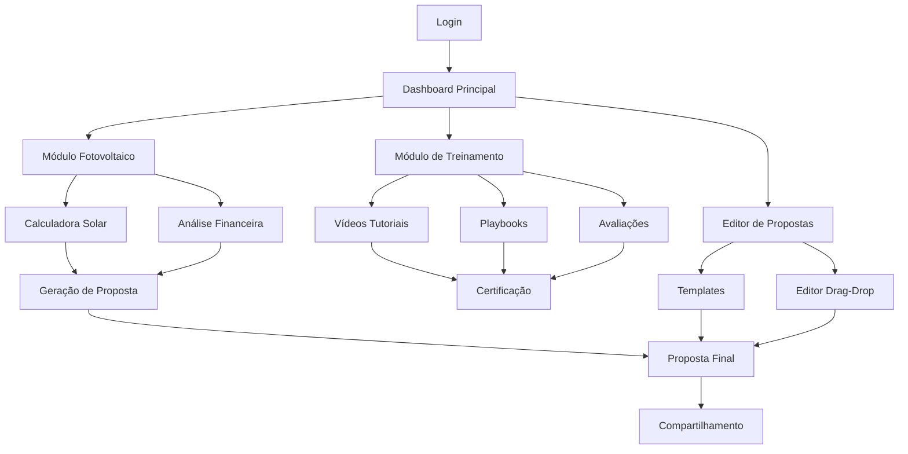

# PRD - PRODUCT REQUIREMENTS DOCUMENT
# SOLARA NOVA ENERGIA - ROADMAP DE MELHORIAS 2025

## 1. Product Overview

O Solara Nova Energia é uma plataforma completa para dimensionamento, análise financeira e geração de propostas para sistemas de energia solar fotovoltaica. A plataforma integra cálculos precisos baseados na Lei 14.300/2022, sistema de treinamento corporativo e geração automatizada de propostas comerciais.

O sistema resolve problemas críticos do setor solar brasileiro: cálculos financeiros imprecisos, falta de padronização em propostas e ausência de treinamento estruturado para equipes técnicas e comerciais.

O projeto visa se tornar a principal ferramenta do mercado solar brasileiro, com potencial de expansão para outros estados e modalidades de energia renovável.

## 2. Core Features

### 2.1 User Roles

| Role | Registration Method | Core Permissions |
|------|---------------------|------------------|
| Administrador | Criação manual pelo sistema | Acesso total, configurações globais, gestão de usuários |
| Gerente Comercial | Convite por administrador | Criação/edição de propostas, acesso a relatórios, treinamentos comerciais |
| Engenheiro | Convite por administrador | Dimensionamento técnico, validação de projetos, treinamentos de engenharia |
| Instalador | Convite por administrador | Acesso a procedimentos, treinamentos de instalação, checklist de campo |
| Vendedor | Convite por gerente | Geração de propostas básicas, treinamentos comerciais |

### 2.2 Feature Module

Nossa plataforma consiste nas seguintes páginas principais:

1. **Dashboard Principal**: visão geral de projetos, métricas de performance, notificações e acesso rápido aos módulos.
2. **Módulo Fotovoltaico**: calculadora solar, análise financeira, dimensionamento de sistemas e simulações de economia.
3. **Módulo de Treinamento**: upload de vídeos, playbooks interativos, fluxogramas, avaliações e acompanhamento de progresso.
4. **Editor de Propostas**: criação drag-and-drop, templates personalizáveis, formatos A4/16:9, animações e compartilhamento.
5. **Gestão de Leads**: cadastro de clientes, histórico de propostas, pipeline de vendas e relatórios comerciais.
6. **Biblioteca de Equipamentos**: catálogo de módulos, inversores e baterias com preços atualizados.
7. **Relatórios e Analytics**: dashboards de performance, métricas de vendas, progresso de treinamentos e análises financeiras.

### 2.3 Page Details

| Page Name | Module Name | Feature description |
|-----------|-------------|---------------------|
| Dashboard Principal | Visão Geral | Exibir métricas de projetos ativos, propostas geradas, progresso de treinamentos e notificações importantes |
| Dashboard Principal | Acesso Rápido | Navegação direta para módulos principais com ícones intuitivos e contadores de status |
| Módulo Fotovoltaico | Calculadora Solar | Calcular dimensionamento baseado em consumo, irradiação solar e características do telhado |
| Módulo Fotovoltaico | Análise Financeira | Computar VPL, TIR, payback e economia de 25 anos conforme Lei 14.300 |
| Módulo Fotovoltaico | Simulador de Cenários | Comparar diferentes configurações de sistema e condições de financiamento |
| Módulo de Treinamento | Upload de Vídeos | Hospedar vídeos com segurança, watermark dinâmico e controle de acesso por categoria |
| Módulo de Treinamento | Editor de Playbooks | Criar documentos estruturados estilo Notion com blocos de texto, imagens e vídeos |
| Módulo de Treinamento | Editor de Fluxogramas | Desenhar processos e mind maps com interface drag-and-drop estilo Whimsical |
| Módulo de Treinamento | Sistema de Avaliações | Criar questionários, aplicar testes e gerar certificados automáticos |
| Módulo de Treinamento | Acompanhamento de Progresso | Visualizar estatísticas de estudo, módulos concluídos e performance individual |
| Editor de Propostas | Canvas Drag-and-Drop | Arrastar elementos visuais, textos e gráficos para criar propostas personalizadas |
| Editor de Propostas | Gestão de Templates | Importar modelos DOC/DOCX/PDF/PPT e criar templates reutilizáveis |
| Editor de Propostas | Formatos e Animações | Suportar layouts A4 (Word) e 16:9 (PowerPoint) com transições fade-in/fade-out |
| Gestão de Leads | Cadastro de Clientes | Registrar informações completas, histórico de contatos e dados de consumo |
| Gestão de Leads | Pipeline de Vendas | Acompanhar estágios de negociação, probabilidades e previsões de fechamento |
| Biblioteca de Equipamentos | Catálogo de Produtos | Manter base atualizada de módulos, inversores e baterias com preços e especificações |
| Biblioteca de Equipamentos | Comparador de Equipamentos | Analisar custo-benefício, eficiência e compatibilidade entre diferentes produtos |
| Relatórios e Analytics | Dashboards Comerciais | Apresentar métricas de vendas, conversão de leads e performance de vendedores |
| Relatórios e Analytics | Relatórios de Treinamento | Monitorar progresso de equipes, identificar gaps de conhecimento e eficácia dos cursos |

## 3. Core Process

### Fluxo do Usuário Comercial:
1. Login na plataforma → Dashboard com visão geral de leads e propostas
2. Cadastro de novo lead → Preenchimento de dados de consumo e localização
3. Dimensionamento do sistema → Calculadora solar com análise de viabilidade
4. Criação de proposta → Editor drag-and-drop com templates personalizáveis
5. Compartilhamento → Envio seguro com tracking de visualizações
6. Acompanhamento → Pipeline de vendas até fechamento

### Fluxo do Usuário de Treinamento:
1. Login na plataforma → Dashboard de treinamentos por categoria de acesso
2. Seleção de módulo → Visualização de conteúdo disponível e progresso
3. Consumo de conteúdo → Vídeos, playbooks e materiais interativos
4. Avaliações → Testes de conhecimento com feedback automático
5. Certificação → Geração automática após aprovação
6. Acompanhamento → Relatórios de progresso e performance

## 4. User Interface Design

### 4.1 Design Style

- **Cores Primárias**: Azul solar (#0EA5E9), Verde energia (#10B981), Branco (#FFFFFF)
- **Cores Secundárias**: Cinza moderno (#64748B), Amarelo solar (#F59E0B), Vermelho alerta (#EF4444)
- **Estilo de Botões**: Rounded corners (8px), gradientes sutis, estados hover com elevação
- **Tipografia**: Inter (títulos), Source Sans Pro (corpo), tamanhos 14px-32px
- **Layout**: Design system baseado em cards, navegação lateral retrátil, grid responsivo
- **Ícones**: Lucide React com estilo outline, tamanho 20px-24px, cores consistentes

### 4.2 Page Design Overview

| Page Name | Module Name | UI Elements |
|-----------|-------------|-------------|
| Dashboard Principal | Header Navigation | Logo Solara, menu hambúrguer, notificações (badge), perfil do usuário com dropdown |
| Dashboard Principal | Cards de Métricas | Grid 2x2 com ícones coloridos, números grandes, gráficos sparkline, cores #0EA5E9/#10B981 |
| Módulo Fotovoltaico | Calculadora | Form steps com progress bar, inputs com validação, botões CTA azuis, resultados em cards |
| Módulo de Treinamento | Video Player | Player customizado com watermark, controles personalizados, progress tracking, fullscreen |
| Módulo de Treinamento | Editor de Playbooks | Interface estilo Notion com sidebar de blocos, toolbar flutuante, preview em tempo real |
| Editor de Propostas | Canvas Drag-Drop | Área de trabalho infinita, paleta de elementos lateral, propriedades à direita, zoom controls |
| Editor de Propostas | Templates Gallery | Grid de cards com preview, filtros por categoria, search bar, tags coloridas |

### 4.3 Responsiveness

A plataforma é desktop-first com adaptação mobile progressiva. Breakpoints: 1440px (desktop), 1024px (tablet), 768px (mobile). Touch interactions otimizadas para drag-and-drop em tablets. Menu lateral colapsa em hambúrguer em telas menores que 1024px.
