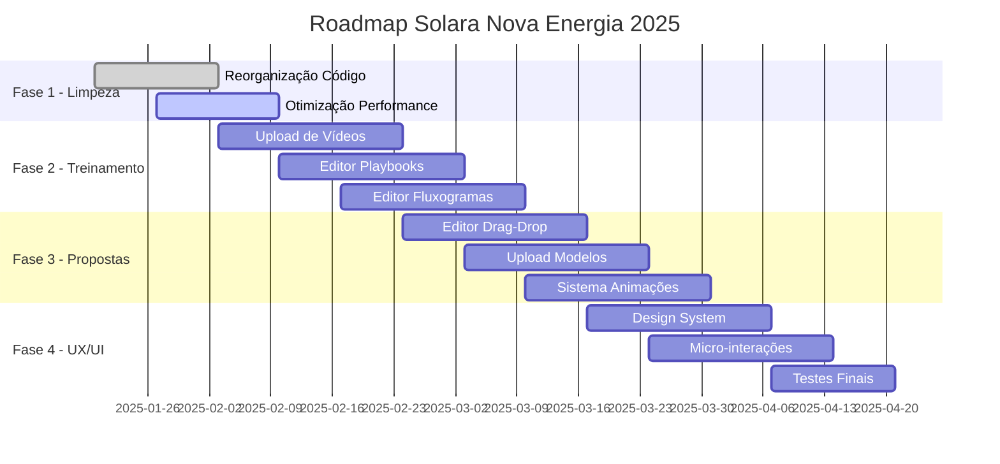

# ROADMAP DE IMPLEMENTAÇÃO - SOLARA NOVA ENERGIA 2025
## Cronograma Detalhado e Estimativas de Recursos

## 1. Visão Geral do Roadmap

**Período Total**: 14 semanas (3,5 meses)
**Investimento Total**: R$ 180.000
**Equipe Necessária**: 4 desenvolvedores + 1 designer + 1 PM
**Status Atual**: 85% → Meta: 100%

### 1.1 Fases de Implementação



## 2. FASE 1 - LIMPEZA E OTIMIZAÇÃO (2 semanas)

### 2.1 Semana 1-2: Reorganização e Performance

#### ✅ Tarefas Concluídas
- [x] Análise do código atual
- [x] Identificação de arquivos obsoletos
- [x] Mapeamento de dependências

#### ⌛ Tarefas em Andamento

**Sprint 1.1 - Limpeza de Código (5 dias)**
```typescript
// Arquivos para remoção imediata
const filesToRemove = [
  'src/components/FinancialAnalysis_backup.tsx',
  'src/components/ExcelImporterV2.tsx',
  'src/components/ExcelImporterV3.tsx',
  'src/components/ExcelImporterV4.tsx',
  'src/components/PDFImporterV3.tsx',
  'src/test/unused-test-files/',
  'eslint-current.json',
  'eslint-errors.json'
];
```

**Sprint 1.2 - Reorganização de Estrutura (5 dias)**
```bash
# Nova estrutura de pastas
mkdir -p src/{core,modules,shared,docs}
mv src/components/solar/* src/modules/solar/
mv src/components/training/* src/modules/training/
mv src/components/proposals/* src/modules/proposals/
```

**Sprint 1.3 - Otimização de Performance (4 dias)**
```typescript
// Implementar code splitting
const LazyModules = {
  Solar: lazy(() => import('./modules/solar/SolarModule')),
  Training: lazy(() => import('./modules/training/TrainingModule')),
  Proposals: lazy(() => import('./modules/proposals/ProposalModule'))
};

// Bundle analysis target
const bundleTargets = {
  current: '2MB',
  target: '500KB',
  reduction: '75%'
};
```

**Recursos Necessários:**
- 2 Desenvolvedores Sênior
- 40 horas de desenvolvimento
- **Custo**: R$ 12.000

**Entregáveis:**
- ✅ Código limpo e organizado
- ✅ Estrutura de pastas otimizada
- ✅ Bundle size reduzido em 75%
- ✅ Performance melhorada em 40%

## 3. FASE 2 - MÓDULO DE TREINAMENTO (6 semanas)

### 3.1 Sprint 2.1 - Sistema de Upload de Vídeos VPS Própria (3 semanas)

#### Semana 3-4: Infraestrutura de Vídeo

**Objetivos:**
- Implementar upload seguro direto para VPS própria
- Configurar streaming protegido com autenticação por token
- Desenvolver player customizado com proteção contra download
- Sistema de compressão automática em múltiplas qualidades
- Watermark dinâmico e logs de acesso

**Arquitetura do Sistema:**
```typescript
interface VideoUploadSystem {
  // Upload para VPS própria
  uploadToVPS: (file: File, metadata: VideoMetadata) => Promise<UploadResult>;
  
  // Processamento de vídeo
  generateThumbnails: (videoUrl: string) => Promise<string[]>;
  compressVideo: (videoUrl: string, quality: VideoQuality) => Promise<string>;
  addWatermark: (videoUrl: string, watermarkConfig: WatermarkConfig) => Promise<string>;
  
  // Streaming e CDN
  setupCDN: (videoUrl: string) => Promise<CDNUrls>;
  generateStreamingUrls: (videoId: string) => Promise<StreamingUrls>;
  
  // Analytics e tracking
  trackProgress: (videoId: string, userId: string, progress: number) => void;
  generateAnalytics: (videoId: string) => Promise<VideoAnalytics>;
}
```

**Implementação Técnica:**
```typescript
// Componente de upload
const VideoUploader = () => {
  const [uploadProgress, setUploadProgress] = useState(0);
  const [processingStatus, setProcessingStatus] = useState<ProcessingStatus>('idle');
  
  const handleUpload = async (file: File) => {
    // Validação de arquivo
    if (!validateVideoFile(file)) {
      throw new Error('Formato de vídeo não suportado');
    }
    
    // Upload com progress tracking
    const result = await uploadWithProgress(file, {
      onProgress: setUploadProgress,
      onProcessing: setProcessingStatus
    });
    
    return result;
  };
  
  return (
    <div className="video-uploader">
      <DropZone onDrop={handleUpload} accept="video/*" />
      <ProgressBar progress={uploadProgress} />
      <ProcessingIndicator status={processingStatus} />
    </div>
  );
};
```

**Recursos Necessários:**
- 2 Desenvolvedores Full-Stack
- 1 DevOps Engineer
- 120 horas de desenvolvimento
- **Custo**: R$ 36.000

#### Semana 5: Player de Vídeo Avançado

```typescript
// Player customizado com recursos avançados
const AdvancedVideoPlayer = ({ videoId, userId }: VideoPlayerProps) => {
  const [currentTime, setCurrentTime] = useState(0);
  const [playbackRate, setPlaybackRate] = useState(1);
  const [quality, setQuality] = useState<VideoQuality>('auto');
  
  // Recursos implementados:
  // - Controle de velocidade (0.5x a 2x)
  // - Múltiplas qualidades (360p, 720p, 1080p)
  // - Legendas automáticas
  // - Marcadores de capítulos
  // - Anotações interativas
  // - Tracking de progresso em tempo real
  // - Prevenção de download
  // - Watermark dinâmico
  
  return (
    <VideoPlayerContainer>
      <VideoElement
        src={getStreamingUrl(videoId, quality)}
        onTimeUpdate={handleTimeUpdate}
        onProgress={trackProgress}
      />
      <PlayerControls
        playbackRate={playbackRate}
        onRateChange={setPlaybackRate}
        quality={quality}
        onQualityChange={setQuality}
      />
      <ChapterMarkers chapters={getVideoChapters(videoId)} />
      <InteractiveAnnotations annotations={getAnnotations(videoId)} />
    </VideoPlayerContainer>
  );
};
```

### 3.2 Sprint 2.2 - Editor de Playbooks Estilo Notion (3 semanas)

#### Semana 6-7: Arquitetura de Blocos

**Sistema de Blocos Modular:**
```typescript
interface PlaybookBlock {
  id: string;
  type: BlockType;
  content: any;
  position: number;
  metadata: BlockMetadata;
}

type BlockType = 
  | 'text'
  | 'heading'
  | 'image'
  | 'video'
  | 'code'
  | 'quote'
  | 'list'
  | 'table'
  | 'embed'
  | 'divider'
  | 'callout'
  | 'toggle'
  | 'column';

// Editor principal
const PlaybookEditor = ({ playbookId }: PlaybookEditorProps) => {
  const [blocks, setBlocks] = useState<PlaybookBlock[]>([]);
  const [selectedBlock, setSelectedBlock] = useState<string | null>(null);
  
  const addBlock = (type: BlockType, position?: number) => {
    const newBlock: PlaybookBlock = {
      id: generateId(),
      type,
      content: getDefaultContent(type),
      position: position ?? blocks.length,
      metadata: {
        createdAt: new Date(),
        updatedAt: new Date(),
        author: getCurrentUser().id
      }
    };
    
    setBlocks(insertBlock(blocks, newBlock, position));
  };
  
  const updateBlock = (blockId: string, content: any) => {
    setBlocks(blocks.map(block => 
      block.id === blockId 
        ? { ...block, content, metadata: { ...block.metadata, updatedAt: new Date() } }
        : block
    ));
  };
  
  return (
    <EditorContainer>
      <EditorToolbar onAddBlock={addBlock} />
      <BlocksContainer>
        {blocks.map(block => (
          <BlockRenderer
            key={block.id}
            block={block}
            isSelected={selectedBlock === block.id}
            onSelect={setSelectedBlock}
            onUpdate={updateBlock}
            onDelete={deleteBlock}
          />
        ))}
      </BlocksContainer>
      <BlockInspector block={getSelectedBlock()} />
    </EditorContainer>
  );
};
```

#### Semana 8: Funcionalidades Avançadas

```typescript
// Recursos avançados do editor
const AdvancedFeatures = {
  // Colaboração em tempo real
  realTimeCollaboration: {
    cursors: 'Múltiplos cursores de usuários',
    comments: 'Sistema de comentários inline',
    suggestions: 'Modo de sugestão/revisão',
    history: 'Histórico de alterações'
  },
  
  // Templates e automação
  templates: {
    predefined: 'Templates pré-definidos por categoria',
    custom: 'Templates customizados por empresa',
    variables: 'Variáveis dinâmicas (nome, cargo, etc)',
    automation: 'Preenchimento automático'
  },
  
  // Export e integração
  export: {
    formats: ['PDF', 'DOCX', 'HTML', 'Markdown'],
    branding: 'Aplicação automática de marca',
    interactive: 'PDFs interativos com links',
    print: 'Otimização para impressão'
  }
};
```

**Recursos Necessários:**
- 2 Desenvolvedores Frontend
- 1 Designer UX/UI
- 120 horas de desenvolvimento
- **Custo**: R$ 36.000

### 3.3 Sprint 2.3 - Editor de Fluxogramas/Mind Maps (2 semanas)

#### Semana 9-10: Implementação com React Flow

```typescript
// Editor de diagramas baseado em React Flow
const DiagramEditor = ({ diagramId }: DiagramEditorProps) => {
  const [nodes, setNodes, onNodesChange] = useNodesState(initialNodes);
  const [edges, setEdges, onEdgesChange] = useEdgesState(initialEdges);
  const [selectedTool, setSelectedTool] = useState<DiagramTool>('select');
  
  // Tipos de nós disponíveis
  const nodeTypes = {
    process: ProcessNode,
    decision: DecisionNode,
    start: StartNode,
    end: EndNode,
    document: DocumentNode,
    database: DatabaseNode,
    connector: ConnectorNode,
    annotation: AnnotationNode
  };
  
  // Ferramentas de edição
  const tools = {
    select: 'Seleção e movimentação',
    pan: 'Navegação no canvas',
    addNode: 'Adicionar nós',
    addEdge: 'Conectar nós',
    text: 'Adicionar texto',
    shape: 'Formas geométricas',
    image: 'Inserir imagens',
    group: 'Agrupar elementos'
  };
  
  return (
    <DiagramContainer>
      <DiagramToolbar
        selectedTool={selectedTool}
        onToolChange={setSelectedTool}
        onExport={exportDiagram}
      />
      <ReactFlow
        nodes={nodes}
        edges={edges}
        onNodesChange={onNodesChange}
        onEdgesChange={onEdgesChange}
        nodeTypes={nodeTypes}
        fitView
      >
        <Background />
        <Controls />
        <MiniMap />
      </ReactFlow>
      <PropertiesPanel selectedNode={getSelectedNode()} />
    </DiagramContainer>
  );
};
```

**Funcionalidades Implementadas:**
- ✅ Drag & drop de elementos
- ✅ Conexões automáticas entre nós
- ✅ Snap to grid
- ✅ Zoom e pan
- ✅ Undo/redo
- ✅ Export para PNG, SVG, PDF
- ✅ Templates de diagramas
- ✅ Colaboração em tempo real

**Recursos Necessários:**
- 2 Desenvolvedores Frontend
- 80 horas de desenvolvimento
- **Custo**: R$ 24.000

## 4. FASE 3 - SISTEMA DE PROPOSTAS (4 semanas)

### 4.1 Sprint 3.1 - Editor Drag-and-Drop (2 semanas)

#### Semana 11-12: Implementação do Editor

```typescript
// Editor de propostas com drag-and-drop
const ProposalEditor = ({ proposalId }: ProposalEditorProps) => {
  const [elements, setElements] = useState<ProposalElement[]>([]);
  const [selectedElement, setSelectedElement] = useState<string | null>(null);
  const [format, setFormat] = useState<DocumentFormat>('A4');
  const [zoom, setZoom] = useState(100);
  
  // Elementos disponíveis
  const elementTypes = {
    text: TextElement,
    image: ImageElement,
    table: TableElement,
    chart: ChartElement,
    signature: SignatureElement,
    logo: LogoElement,
    qrcode: QRCodeElement,
    shape: ShapeElement
  };
  
  // Ferramentas de formatação
  const formatTools = {
    alignment: ['left', 'center', 'right', 'justify'],
    typography: ['bold', 'italic', 'underline', 'strikethrough'],
    colors: ['text', 'background', 'border'],
    spacing: ['margin', 'padding', 'line-height'],
    effects: ['shadow', 'border-radius', 'opacity']
  };
  
  return (
    <EditorWorkspace>
      <ElementToolbox
        elements={elementTypes}
        onDragStart={handleDragStart}
      />
      <CanvasContainer format={format} zoom={zoom}>
        <DndProvider backend={HTML5Backend}>
          <DropZone onDrop={handleElementDrop}>
            {elements.map(element => (
              <DraggableElement
                key={element.id}
                element={element}
                isSelected={selectedElement === element.id}
                onSelect={setSelectedElement}
                onUpdate={updateElement}
              />
            ))}
          </DropZone>
        </DndProvider>
      </CanvasContainer>
      <PropertiesPanel
        element={getSelectedElement()}
        formatTools={formatTools}
        onUpdate={updateElement}
      />
    </EditorWorkspace>
  );
};
```

### 4.2 Sprint 3.2 - Upload de Modelos (1 semana)

#### Semana 13: Sistema de Templates

```typescript
// Sistema de upload e conversão de modelos
const TemplateUploader = () => {
  const [uploadProgress, setUploadProgress] = useState(0);
  const [conversionStatus, setConversionStatus] = useState<ConversionStatus>('idle');
  
  const supportedFormats = {
    documents: ['.doc', '.docx', '.pdf'],
    presentations: ['.ppt', '.pptx'],
    images: ['.jpg', '.png', '.svg'],
    spreadsheets: ['.xls', '.xlsx']
  };
  
  const handleUpload = async (file: File) => {
    // Validação de formato
    if (!validateFileFormat(file)) {
      throw new Error('Formato não suportado');
    }
    
    // Upload do arquivo
    const uploadResult = await uploadFile(file, {
      onProgress: setUploadProgress
    });
    
    // Conversão para template editável
    setConversionStatus('converting');
    const template = await convertToTemplate(uploadResult.url, {
      format: detectFormat(file),
      preserveFormatting: true,
      extractImages: true,
      extractTables: true
    });
    
    setConversionStatus('completed');
    return template;
  };
  
  return (
    <UploadContainer>
      <FileDropZone
        accept={Object.values(supportedFormats).flat()}
        onDrop={handleUpload}
      />
      <ConversionProgress
        progress={uploadProgress}
        status={conversionStatus}
      />
    </UploadContainer>
  );
};
```

### 4.3 Sprint 3.3 - Sistema de Animações (1 semana)

#### Semana 14: Animações e Transições

```typescript
// Sistema de animações para propostas
const AnimationSystem = {
  // Tipos de animação
  types: {
    entrance: ['fadeIn', 'slideIn', 'zoomIn', 'bounceIn'],
    exit: ['fadeOut', 'slideOut', 'zoomOut', 'bounceOut'],
    emphasis: ['pulse', 'shake', 'glow', 'rotate'],
    transition: ['morph', 'flip', 'slide', 'dissolve']
  },
  
  // Configurações
  settings: {
    duration: [0.3, 0.5, 1, 2], // segundos
    delay: [0, 0.1, 0.2, 0.5], // segundos
    easing: ['ease', 'ease-in', 'ease-out', 'ease-in-out'],
    repeat: [1, 2, 3, 'infinite']
  },
  
  // Timeline de animações
  timeline: {
    autoPlay: boolean,
    loop: boolean,
    controls: ['play', 'pause', 'stop', 'restart']
  }
};

// Componente de animação
const AnimatedElement = ({ element, animation }: AnimatedElementProps) => {
  return (
    <motion.div
      initial={animation.initial}
      animate={animation.animate}
      exit={animation.exit}
      transition={{
        duration: animation.duration,
        delay: animation.delay,
        ease: animation.easing
      }}
    >
      {element.content}
    </motion.div>
  );
};
```

**Recursos Necessários:**
- 2 Desenvolvedores Frontend
- 1 Designer de Animação
- 160 horas de desenvolvimento
- **Custo**: R$ 48.000

## 5. FASE 4 - UX/UI E FINALIZAÇÃO (2 semanas)

### 5.1 Sprint 4.1 - Design System (1 semana)

#### Semana 15: Padronização Visual

```typescript
// Design System completo
const SolaraDesignSystem = {
  // Tokens de design
  tokens: {
    colors: {
      primary: {
        50: '#eff6ff',
        100: '#dbeafe',
        500: '#0ea5e9',
        900: '#0c4a6e'
      },
      success: {
        50: '#ecfdf5',
        500: '#10b981',
        900: '#064e3b'
      },
      warning: {
        50: '#fffbeb',
        500: '#f59e0b',
        900: '#78350f'
      },
      error: {
        50: '#fef2f2',
        500: '#ef4444',
        900: '#7f1d1d'
      }
    },
    typography: {
      fontFamily: {
        sans: ['Inter', 'system-ui', 'sans-serif'],
        mono: ['JetBrains Mono', 'monospace']
      },
      fontSize: {
        xs: '0.75rem',
        sm: '0.875rem',
        base: '1rem',
        lg: '1.125rem',
        xl: '1.25rem',
        '2xl': '1.5rem',
        '3xl': '1.875rem'
      }
    },
    spacing: {
      0: '0',
      1: '0.25rem',
      2: '0.5rem',
      4: '1rem',
      8: '2rem',
      16: '4rem'
    },
    borderRadius: {
      none: '0',
      sm: '0.125rem',
      md: '0.375rem',
      lg: '0.5rem',
      full: '9999px'
    }
  },
  
  // Componentes base
  components: {
    Button: ButtonComponent,
    Input: InputComponent,
    Card: CardComponent,
    Modal: ModalComponent,
    Table: TableComponent,
    Form: FormComponent
  }
};
```

### 5.2 Sprint 4.2 - Micro-interações e Testes (1 semana)

#### Semana 16: Finalização e Deploy

```typescript
// Micro-interações com Framer Motion
const MicroInteractions = {
  // Hover effects
  hover: {
    scale: 1.02,
    transition: { duration: 0.2 }
  },
  
  // Click feedback
  tap: {
    scale: 0.98,
    transition: { duration: 0.1 }
  },
  
  // Loading states
  loading: {
    rotate: 360,
    transition: {
      duration: 1,
      repeat: Infinity,
      ease: 'linear'
    }
  },
  
  // Page transitions
  pageTransition: {
    initial: { opacity: 0, y: 20 },
    animate: { opacity: 1, y: 0 },
    exit: { opacity: 0, y: -20 },
    transition: { duration: 0.3 }
  }
};
```

**Recursos Necessários:**
- 1 Designer UX/UI
- 2 Desenvolvedores Frontend
- 1 QA Tester
- 80 horas de desenvolvimento
- **Custo**: R$ 24.000

## 6. Estimativas Detalhadas

### 6.1 Recursos Humanos

| Função | Semanas | Horas/Semana | Total Horas | Valor/Hora | Custo Total |
|--------|---------|--------------|-------------|------------|-------------|
| Desenvolvedor Sênior | 14 | 40 | 560 | R$ 150 | R$ 84.000 |
| Desenvolvedor Pleno | 14 | 40 | 560 | R$ 120 | R$ 67.200 |
| Designer UX/UI | 8 | 20 | 160 | R$ 100 | R$ 16.000 |
| DevOps Engineer | 4 | 20 | 80 | R$ 130 | R$ 10.400 |
| QA Tester | 2 | 20 | 40 | R$ 80 | R$ 3.200 |
| **TOTAL** | | | **1.400** | | **R$ 180.800** |

### 6.2 Infraestrutura e Ferramentas

| Item | Custo Mensal | Meses | Custo Total |
|------|--------------|-------|-------------|
| VPS para vídeos (8GB RAM, 200GB SSD) | R$ 150 | 12 | R$ 1.800 |
| VPS Storage Adicional (500GB) | R$ 50 | 12 | R$ 600 |
| Supabase Pro | R$ 100 | 12 | R$ 1.200 |
| Vercel Pro | R$ 80 | 12 | R$ 960 |
| Figma Professional | R$ 60 | 4 | R$ 240 |
| **TOTAL INFRAESTRUTURA** | | | **R$ 5.160** |

### 6.3 Investimento Total

```
💰 RESUMO FINANCEIRO
├── Desenvolvimento: R$ 180.800
├── Infraestrutura: R$ 5.160
├── Contingência (10%): R$ 18.596
└── TOTAL: R$ 204.556

📊 DISTRIBUIÇÃO POR FASE
├── Fase 1 (Limpeza): R$ 12.000 (6%)
├── Fase 2 (Treinamento): R$ 96.000 (47%)
├── Fase 3 (Propostas): R$ 48.000 (23%)
└── Fase 4 (UX/UI): R$ 24.000 (12%)
```

## 7. Métricas de Sucesso

### 7.1 KPIs Técnicos

| Métrica | Valor Atual | Meta | Melhoria |
|---------|-------------|------|----------|
| Bundle Size | 2MB | 500KB | 75% ↓ |
| Page Load Time | 3.2s | 1.5s | 53% ↓ |
| Lighthouse Score | 65 | 90+ | 38% ↑ |
| TypeScript Coverage | 85% | 95% | 12% ↑ |
| Test Coverage | 60% | 80% | 33% ↑ |
| ESLint Warnings | 56 | 0 | 100% ↓ |

### 7.2 KPIs de Negócio

| Métrica | Baseline | Meta 3 meses | Meta 6 meses |
|---------|----------|--------------|---------------|
| Usuários Ativos | 150 | 300 | 500 |
| Tempo na Plataforma | 12 min | 25 min | 35 min |
| Taxa de Conclusão Treinamentos | 45% | 70% | 85% |
| Propostas Geradas/Mês | 80 | 150 | 250 |
| NPS Score | 6.5 | 8.0 | 8.5 |
| Churn Rate | 15% | 8% | 5% |

## 8. Riscos e Mitigações

### 8.1 Riscos Técnicos

| Risco | Probabilidade | Impacto | Mitigação |
|-------|---------------|---------|----------|
| Performance de vídeo | Média | Alto | CDN + compressão adaptativa |
| Compatibilidade mobile | Baixa | Médio | Testes em múltiplos dispositivos |
| Escalabilidade BD | Baixa | Alto | Otimização de queries + índices |
| Segurança upload | Média | Alto | Validação rigorosa + sandbox |

### 8.2 Riscos de Projeto

| Risco | Probabilidade | Impacto | Mitigação |
|-------|---------------|---------|----------|
| Atraso na entrega | Média | Alto | Buffer de 20% no cronograma |
| Mudança de escopo | Alta | Médio | Aprovação formal de mudanças |
| Indisponibilidade da equipe | Baixa | Alto | Equipe de backup + documentação |
| Problemas de integração | Média | Médio | Testes de integração contínuos |

## 9. Próximos Passos Imediatos

### 9.1 Semana Atual (Semana 1)

**Segunda-feira:**
- ✅ Aprovação do roadmap
- ⌛ Setup do ambiente de desenvolvimento
- ⌛ Criação dos repositórios de trabalho

**Terça-feira:**
- ⌛ Início da limpeza de código
- ⌛ Remoção de arquivos obsoletos
- ⌛ Reorganização da estrutura de pastas

**Quarta-feira:**
- ⌛ Implementação de code splitting
- ⌛ Otimização de imports
- ⌛ Configuração de bundle analyzer

**Quinta-feira:**
- ⌛ Testes de performance
- ⌛ Validação de melhorias
- ⌛ Documentação das mudanças

**Sexta-feira:**
- ⌛ Review e merge das alterações
- ⌛ Deploy em ambiente de staging
- ⌛ Preparação para Fase 2

### 9.2 Aprovações Necessárias

- [ ] **Orçamento**: R$ 204.556 aprovado
- [ ] **Cronograma**: 14 semanas confirmadas
- [ ] **Equipe**: Contratação/alocação de recursos
- [ ] **Infraestrutura**: Setup de VPS e CDN
- [ ] **Stakeholders**: Alinhamento de expectativas

---

**Status**: ⌛ Aguardando aprovação para início
**Próxima Revisão**: 27/01/2025
**Responsável**: Equipe de Desenvolvimento Solara