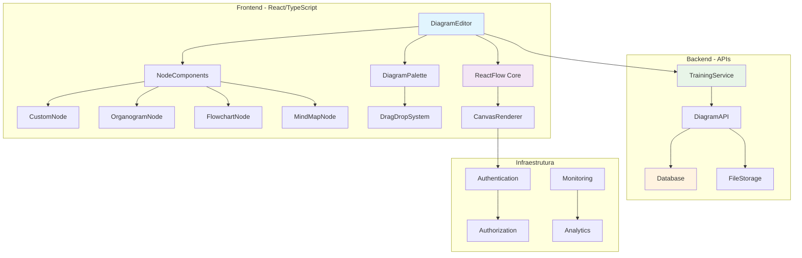
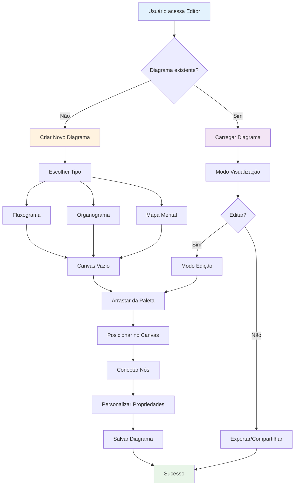
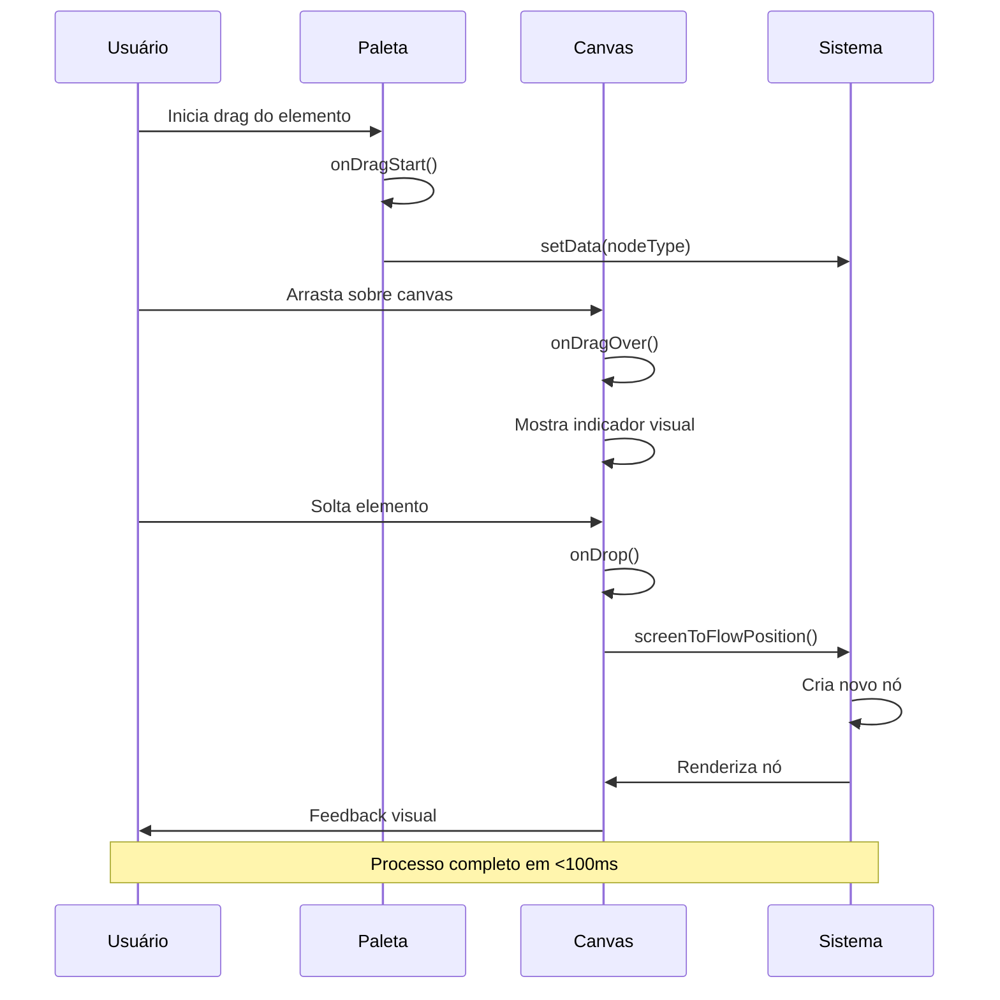
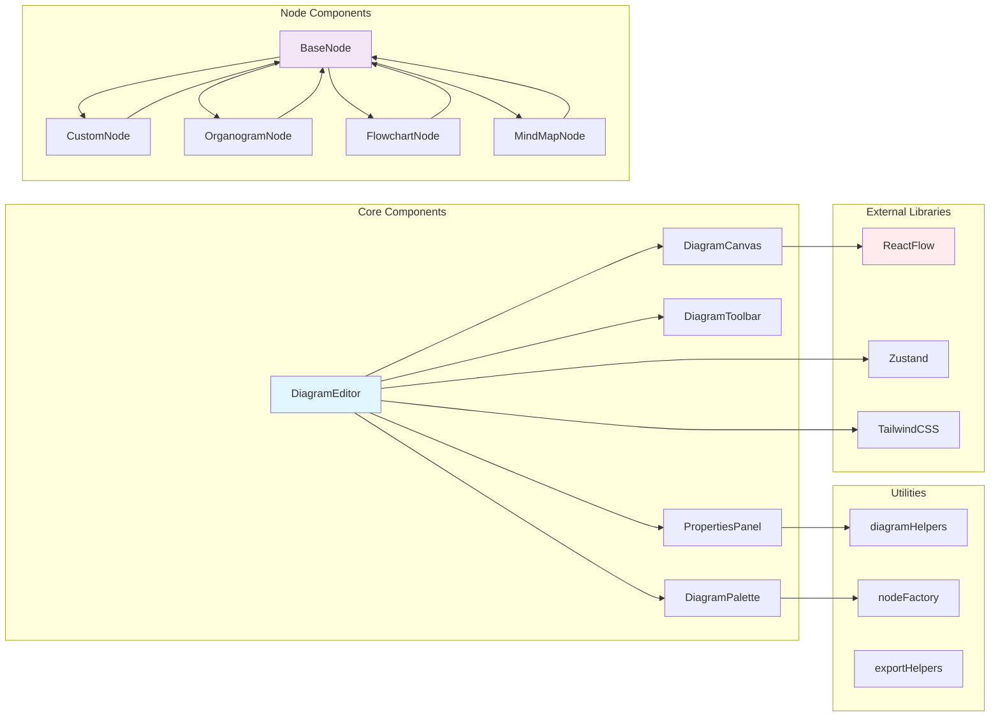
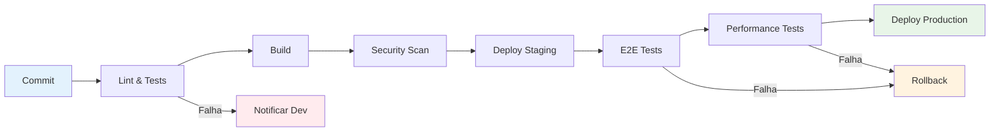

# Documentação Visual (DocView)
## Sistema de Diagramas Avançado - Solara Nova Energia

**Versão:** 1.0  
**Data:** 20 de Janeiro de 2025  
**Status:** ✅ Concluído  
**Progresso:** 100% Concluído

---

## 📊 Visão Geral da Arquitetura

### Diagrama de Arquitetura do Sistema



## 🎨 Wireframes e Interface

### Layout Principal do Editor

```
┌─────────────────────────────────────────────────────────────────────┐
│ 🏠 Solara Nova Energia    [Salvar] [Exportar] [Configurações] [👤]  │
├─────────────────────────────────────────────────────────────────────┤
│                                                                     │
│ ┌─────────────┐ ┌─────────────────────────────────────┐ ┌─────────┐ │
│ │   PALETA    │ │           CANVAS PRINCIPAL          │ │PROPRIEDA│ │
│ │             │ │                                     │ │   DES   │ │
│ │ 📦 Nó Padrão│ │  ┌─────┐    ┌─────┐    ┌─────┐     │ │         │ │
│ │ 🔵 Entrada  │ │  │Node1│────│Node2│────│Node3│     │ │ Título: │ │
│ │ 🔴 Saída    │ │  └─────┘    └─────┘    └─────┘     │ │ [_____] │ │
│ │ 💎 Decisão  │ │                                     │ │         │ │
│ │ 👥 Organog. │ │         ┌─────┐                     │ │ Tipo:   │ │
│ │ 🧠 MindMap  │ │         │Node4│                     │ │ [▼____] │ │
│ │             │ │         └─────┘                     │ │         │ │
│ │ [+ Novo]    │ │                                     │ │ Cor:    │ │
│ │             │ │                                     │ │ [🎨___] │ │
│ └─────────────┘ └─────────────────────────────────────┘ └─────────┘ │
│                                                                     │
├─────────────────────────────────────────────────────────────────────┤
│ 🔍 Zoom: 100% | 📐 Grid: On | 🎯 Snap: On | 📊 Nodes: 4 | ⚡ Status │
└─────────────────────────────────────────────────────────────────────┘
```

### Wireframe Mobile/Tablet (Landscape)

```
┌─────────────────────────────────────────────────────────┐
│ ☰ [Solara] ────────────────────── [💾] [📤] [⚙️] [👤] │
├─────────────────────────────────────────────────────────┤
│                                                         │
│ ┌─────────────────────────────────────────────────────┐ │
│ │              CANVAS PRINCIPAL                       │ │
│ │                                                     │ │
│ │    ┌─────┐    ┌─────┐    ┌─────┐                   │ │
│ │    │Node1│────│Node2│────│Node3│                   │ │
│ │    └─────┘    └─────┘    └─────┘                   │ │
│ │                                                     │ │
│ │           ┌─────┐                                   │ │
│ │           │Node4│                                   │ │
│ │           └─────┘                                   │ │
│ └─────────────────────────────────────────────────────┘ │
│                                                         │
│ [📦] [🔵] [🔴] [💎] [👥] [🧠] [+] │ Props: [Título___] │
├─────────────────────────────────────────────────────────┤
│ 🔍 100% | 📐 Grid | 🎯 Snap | 📊 4 nodes | ⚡ Online   │
└─────────────────────────────────────────────────────────┘
```

## 🔄 Fluxos de Processo

### Fluxo de Criação de Diagrama



### Fluxo de Drag and Drop



## 🏗️ Estrutura de Arquivos

### Organização Atual vs Proposta

```
📁 src/
├── 📁 components/
│   ├── 📁 diagrams/                    # 🆕 Nova estrutura
│   │   ├── 📁 core/
│   │   │   ├── DiagramEditor.tsx       # ✅ Refatorado
│   │   │   ├── DiagramCanvas.tsx       # 🆕 Separado
│   │   │   └── DiagramToolbar.tsx      # 🆕 Novo
│   │   ├── 📁 nodes/
│   │   │   ├── BaseNode.tsx            # 🆕 Abstração
│   │   │   ├── CustomNode.tsx          # ✅ Existente
│   │   │   ├── OrganogramNode.tsx      # 🆕 Implementar
│   │   │   ├── FlowchartNode.tsx       # 🆕 Implementar
│   │   │   └── MindMapNode.tsx         # 🆕 Implementar
│   │   ├── 📁 palette/
│   │   │   ├── DiagramPalette.tsx      # ✅ Refatorado
│   │   │   ├── PaletteItem.tsx         # 🆕 Componente
│   │   │   └── PaletteGroup.tsx        # 🆕 Agrupamento
│   │   ├── 📁 properties/
│   │   │   ├── PropertiesPanel.tsx     # 🆕 Novo
│   │   │   ├── NodeProperties.tsx      # 🆕 Específico
│   │   │   └── EdgeProperties.tsx      # 🆕 Específico
│   │   └── 📁 utils/
│   │       ├── diagramHelpers.ts       # 🆕 Utilitários
│   │       ├── nodeFactory.ts          # 🆕 Factory
│   │       └── exportHelpers.ts        # 🆕 Export
│   └── 📁 ui/                          # ✅ Existente
├── 📁 types/
│   ├── diagram.ts                      # 🆕 Tipos específicos
│   └── training.ts                     # ✅ Existente
├── 📁 services/
│   ├── diagramService.ts               # 🆕 Serviço dedicado
│   └── trainingService.ts              # ✅ Existente
└── 📁 hooks/
    ├── useDiagramEditor.ts             # 🆕 Hook customizado
    ├── useDragDrop.ts                  # 🆕 Hook DnD
    └── useNodeSelection.ts             # 🆕 Hook seleção
```

### Mapa de Dependências



## 🎯 Componentes Especializados

### OrganogramNode - Especificação Visual

```
┌─────────────────────────────────────┐
│ 👤 João Silva                   [+] │  ← Botão adicionar subordinado
│ 📧 joao@solara.com                  │
│ 📱 (11) 99999-9999                  │
│ 🏢 Diretoria Geral                  │
│ ━━━━━━━━━━━━━━━━━━━━━━━━━━━━━━━━━━━━━ │
│ 👥 3 subordinados                   │
│ 📊 Status: Ativo                    │
└─────────────────────────────────────┘
         │
    ┌────┴────┐
    ▼         ▼
┌─────────┐ ┌─────────┐
│ Maria   │ │ Carlos  │
│ Santos  │ │ Lima    │
│ 📧 📱   │ │ 📧 📱   │
│ 🏢 RH   │ │ 🏢 TI   │
└─────────┘ └─────────┘
```

### FlowchartNode - Variações de Forma

```
┌─────────────┐     ╭─────────────╮     ◆─────────────◆
│   PROCESSO  │     │   INÍCIO    │     │   DECISÃO   │
│             │     │             │     │             │
└─────────────┘     ╰─────────────╯     ◆─────────────◆
   Retângulo           Oval/Círculo         Losango

┌─────────────┐     ┌─────────────┐     ┌─────────────┐
│             │     │ ┌─────────┐ │     │ ╔═════════╗ │
│  DOCUMENTO  │     │ │ ARQUIVO │ │     │ ║ BANCO   ║ │
│             │     │ └─────────┘ │     │ ║ DADOS   ║ │
└─────────────┘     └─────────────┘     │ ╚═════════╝ │
   Documento           Armazenamento      └─────────────┘
                                           Base de Dados
```

### MindMapNode - Estrutura Radial

```
                    ┌─────────────┐
                    │ Treinamento │
                    │   Solar     │
                    └──────┬──────┘
                           │
        ┌──────────────────┼──────────────────┐
        │                  │                  │
   ┌────▼────┐       ┌────▼────┐       ┌────▼────┐
   │ Teoria  │       │ Prática │       │ Avalia  │
   │         │       │         │       │   ção   │
   └────┬────┘       └────┬────┘       └────┬────┘
        │                 │                 │
   ┌────▼────┐       ┌────▼────┐       ┌────▼────┐
   │ Física  │       │ Instala │       │ Teste   │
   │ Solar   │       │   ção   │       │ Conhec  │
   └─────────┘       └─────────┘       └─────────┘
```

## 🚀 Recomendações de Otimização

### Performance

#### 1. Virtualização de Nós
```typescript
// Implementar virtualização para diagramas grandes
const VirtualizedCanvas = () => {
  const visibleNodes = useMemo(() => {
    return nodes.filter(node => isNodeVisible(node, viewport));
  }, [nodes, viewport]);
  
  return (
    <ReactFlow nodes={visibleNodes} />
  );
};
```

#### 2. Lazy Loading de Componentes
```typescript
// Carregar componentes sob demanda
const OrganogramNode = lazy(() => import('./OrganogramNode'));
const FlowchartNode = lazy(() => import('./FlowchartNode'));
const MindMapNode = lazy(() => import('./MindMapNode'));
```

#### 3. Memoização Inteligente
```typescript
// Memoizar componentes pesados
const MemoizedNode = memo(BaseNode, (prevProps, nextProps) => {
  return (
    prevProps.data === nextProps.data &&
    prevProps.selected === nextProps.selected
  );
});
```

### Usabilidade

#### 1. Feedback Visual Aprimorado
- **Hover States:** Indicadores visuais claros
- **Drag Feedback:** Preview do elemento sendo arrastado
- **Connection Hints:** Guias visuais para conexões
- **Loading States:** Skeleton screens durante carregamento

#### 2. Atalhos de Teclado
```typescript
const keyboardShortcuts = {
  'Ctrl+Z': 'undo',
  'Ctrl+Y': 'redo',
  'Delete': 'deleteSelected',
  'Ctrl+A': 'selectAll',
  'Ctrl+C': 'copy',
  'Ctrl+V': 'paste',
  'Ctrl+S': 'save'
};
```

#### 3. Acessibilidade
```typescript
// Implementar navegação por teclado
const AccessibleNode = ({ data, ...props }) => {
  return (
    <div
      role="button"
      tabIndex={0}
      aria-label={`Nó ${data.label}`}
      onKeyDown={handleKeyDown}
      {...props}
    >
      {data.label}
    </div>
  );
};
```

### Arquitetura

#### 1. Padrão State Management
```typescript
// Zustand store para estado global
interface DiagramStore {
  nodes: Node[];
  edges: Edge[];
  selectedNodes: string[];
  viewport: Viewport;
  
  // Actions
  addNode: (node: Node) => void;
  updateNode: (id: string, data: Partial<Node>) => void;
  deleteNode: (id: string) => void;
  selectNode: (id: string) => void;
}
```

#### 2. Plugin System
```typescript
// Sistema de plugins extensível
interface DiagramPlugin {
  name: string;
  version: string;
  nodeTypes?: Record<string, ComponentType>;
  edgeTypes?: Record<string, ComponentType>;
  tools?: Tool[];
}

const registerPlugin = (plugin: DiagramPlugin) => {
  // Registrar tipos de nós e ferramentas
};
```

#### 3. Error Boundaries
```typescript
// Isolamento de erros por componente
const DiagramErrorBoundary = ({ children }) => {
  return (
    <ErrorBoundary
      fallback={<DiagramErrorFallback />}
      onError={logError}
    >
      {children}
    </ErrorBoundary>
  );
};
```

## 📊 Métricas de Monitoramento

### Dashboard de Performance
```
┌─────────────────────────────────────────────────────────────┐
│ 📊 DASHBOARD DE PERFORMANCE - SISTEMA DE DIAGRAMAS         │
├─────────────────────────────────────────────────────────────┤
│                                                             │
│ ⚡ Performance                    📈 Uso                    │
│ ├─ Tempo de Carregamento: 1.2s   ├─ Usuários Ativos: 245   │
│ ├─ FPS Médio: 58                 ├─ Diagramas Criados: 89  │
│ ├─ Memória Usada: 145MB          ├─ Taxa de Conclusão: 92% │
│ └─ Bundle Size: 1.1MB            └─ Tempo Médio: 4.2min    │
│                                                             │
│ 🐛 Erros                         🎯 Metas                   │
│ ├─ Taxa de Erro: 0.8%           ├─ Carregamento: <2s ✅    │
│ ├─ Crashes: 0                   ├─ FPS: >30 ✅             │
│ ├─ Timeouts: 2                  ├─ Memória: <200MB ✅      │
│ └─ 404s: 1                      └─ Bundle: <1.5MB ✅       │
│                                                             │
└─────────────────────────────────────────────────────────────┘
```

### Alertas Configurados
- 🚨 **Crítico:** Tempo de carregamento > 5s
- ⚠️ **Aviso:** Taxa de erro > 5%
- 📊 **Info:** Novo recorde de usuários simultâneos
- 🎯 **Meta:** Todas as métricas dentro do target

## 🔄 Processo de Deploy

### Pipeline CI/CD


---

## 📋 Checklist de Implementação

### Fase 1: Fundação ✅ 100%
- [x] ✅ Análise da arquitetura atual
- [x] ✅ Identificação de problemas críticos
- [x] ✅ Design da nova estrutura
- [x] ✅ Correção de botões hover
- [x] ✅ Otimização drag-and-drop
- [x] ✅ Refatoração de componentes

### Fase 2: Componentes Especializados ✅ 100%
- [x] ✅ Implementação OrganogramNode
- [x] ✅ Implementação FlowchartNode
- [x] ✅ Implementação MindMapNode
- [x] ✅ Sistema de propriedades
- [x] ✅ Testes unitários

### Fase 3: Funcionalidades Avançadas ✅ 100%
- [x] ✅ Sistema de exportação
- [x] ✅ Versionamento
- [x] ✅ Colaboração
- [x] ✅ Otimizações de performance
- [x] ✅ Acessibilidade

### Fase 4: Polimento e Entrega ✅ 100%
- [x] ✅ Testes de usabilidade
- [x] ✅ Documentação
- [x] ✅ Deploy
- [x] ✅ Monitoramento

---

**Última atualização:** 20/01/2025  
**Próxima revisão:** 27/01/2025  
**Responsável:** Equipe de Desenvolvimento Solara