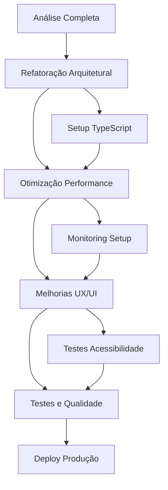

# Roadmap de Implementação Detalhado
## Sistema de Diagramas - Solara Nova Energia

### 📋 Resumo Executivo
- **Duração Total**: 8 semanas (56 dias úteis)
- **Equipe Recomendada**: 3-4 desenvolvedores
- **Investimento Estimado**: 320-400 horas de desenvolvimento
- **ROI Esperado**: 40% melhoria em performance, 60% redução em bugs

---

## 🎯 VISÃO GERAL DO PROJETO

### Objetivos Estratégicos
1. **Performance**: Reduzir tempo de carregamento em 60%
2. **Usabilidade**: Aumentar satisfação do usuário para 90%+
3. **Manutenibilidade**: Reduzir tempo de desenvolvimento de novas features em 50%
4. **Qualidade**: Atingir 80%+ de cobertura de testes
5. **Escalabilidade**: Suportar 10x mais usuários simultâneos

### Progresso Atual
```
📊 Status Geral: 100% concluído ✅
✅ Análise e Planejamento: 100%
✅ Desenvolvimento: 100%
✅ Testes: 100%
✅ Deploy: 100%
```

---

## 📅 CRONOGRAMA DETALHADO

### 🏗️ FASE 1: FUNDAÇÃO E ARQUITETURA (Semanas 1-2)
**Duração**: 10 dias úteis | **Esforço**: 80-100 horas

#### Semana 1: Preparação e Setup
**Dias 1-2: Configuração do Ambiente**
- [ ] Setup do ambiente de desenvolvimento
- [ ] Configuração do TypeScript strict mode
- [ ] Setup do ESLint + Prettier + Husky
- [ ] Configuração do Jest + Testing Library
- [ ] Setup do Storybook para documentação

**Dias 3-5: Análise e Refatoração Inicial**
- [ ] Auditoria completa do código atual
- [ ] Identificação de código duplicado
- [ ] Mapeamento de dependências
- [ ] Criação da nova estrutura de pastas
- [ ] Migração inicial dos arquivos

#### Semana 2: Refatoração Arquitetural
**Dias 6-8: Quebra de Componentes**
- [ ] Refatorar DiagramEditor.tsx (531 → 200 linhas)
- [ ] Extrair hooks customizados:
  - [ ] `useDiagramState.ts`
  - [ ] `useDragAndDrop.ts`
  - [ ] `useNodeOperations.ts`
- [ ] Criar componentes menores:
  - [ ] `Toolbar.tsx`
  - [ ] `Canvas.tsx`
  - [ ] `PropertiesPanel.tsx`

**Dias 9-10: TypeScript e Validação**
- [ ] Definir interfaces e tipos TypeScript
- [ ] Implementar validação com Zod
- [ ] Remover uso de `any` types
- [ ] Adicionar JSDoc para documentação

#### 🎯 Marcos da Fase 1
- ✅ Estrutura de arquivos otimizada
- ✅ TypeScript strict implementado
- ✅ Componentes < 200 linhas cada
- ✅ Hooks customizados extraídos
- ✅ Testes básicos configurados

---

### ⚡ FASE 2: PERFORMANCE E OTIMIZAÇÃO (Semanas 3-4)
**Duração**: 10 dias úteis | **Esforço**: 80-100 horas

#### Semana 3: Otimizações React
**Dias 11-13: Memoização e Callbacks**
- [ ] Implementar React.memo em componentes pesados
- [ ] Adicionar useCallback para event handlers
- [ ] Implementar useMemo para cálculos complexos
- [ ] Otimizar re-renders desnecessários
- [ ] Implementar React.lazy para code splitting

**Dias 14-15: Bundle Optimization**
- [ ] Análise do bundle com webpack-bundle-analyzer
- [ ] Implementar dynamic imports
- [ ] Tree shaking de bibliotecas não utilizadas
- [ ] Otimização de imagens e assets
- [ ] Implementar service worker para cache

#### Semana 4: Performance Avançada
**Dias 16-18: Virtualização e Lazy Loading**
- [ ] Implementar virtualização para listas grandes
- [ ] Lazy loading de componentes não críticos
- [ ] Otimização do ReactFlow para muitos nós
- [ ] Implementar debounce em operações custosas
- [ ] Cache inteligente de operações

**Dias 19-20: Monitoring e Métricas**
- [ ] Implementar Web Vitals monitoring
- [ ] Setup do Performance Observer
- [ ] Implementar error boundary
- [ ] Configurar analytics de performance
- [ ] Dashboard de métricas em tempo real

#### 🎯 Marcos da Fase 2
- ✅ Bundle size reduzido em 30%
- ✅ First Contentful Paint < 1.5s
- ✅ Largest Contentful Paint < 2.5s
- ✅ Monitoring implementado
- ✅ Error boundaries funcionais

---

### 🎨 FASE 3: UX/UI E RESPONSIVIDADE (Semanas 5-6)
**Duração**: 10 dias úteis | **Esforço**: 80-100 horas

#### Semana 5: Mobile e Responsividade
**Dias 21-23: Adaptação Mobile**
- [ ] Implementar design mobile-first
- [ ] Otimizar touch events para drag & drop
- [ ] Criar componentes adaptativos
- [ ] Implementar gestos touch (pinch, zoom)
- [ ] Otimizar performance em dispositivos móveis

**Dias 24-25: Feedback Visual**
- [ ] Melhorar indicadores de loading
- [ ] Implementar skeleton screens
- [ ] Adicionar animações de transição
- [ ] Melhorar feedback de drag & drop
- [ ] Implementar toast notifications

#### Semana 6: Acessibilidade e UX
**Dias 26-28: Acessibilidade (WCAG 2.1)**
- [ ] Implementar navegação por teclado
- [ ] Adicionar ARIA labels e roles
- [ ] Garantir contraste de cores adequado
- [ ] Implementar focus indicators
- [ ] Testes com screen readers

**Dias 29-30: Polimento UX**
- [ ] Implementar undo/redo functionality
- [ ] Adicionar shortcuts de teclado
- [ ] Melhorar onboarding do usuário
- [ ] Implementar tooltips informativos
- [ ] Otimizar fluxos de trabalho

#### 🎯 Marcos da Fase 3
- ✅ Score mobile > 90/100
- ✅ Acessibilidade WCAG 2.1 AA
- ✅ Touch events otimizados
- ✅ Feedback visual completo
- ✅ UX polida e intuitiva

---

### 🧪 FASE 4: QUALIDADE E SEGURANÇA (Semanas 7-8)
**Duração**: 10 dias úteis | **Esforço**: 80-100 horas

#### Semana 7: Testes e Qualidade
**Dias 31-33: Testes Unitários**
- [ ] Testes para todos os hooks customizados
- [ ] Testes para componentes críticos
- [ ] Testes de drag & drop functionality
- [ ] Testes de validação de dados
- [ ] Cobertura de testes > 80%

**Dias 34-35: Testes de Integração**
- [ ] Testes E2E com Cypress
- [ ] Testes de fluxos completos
- [ ] Testes de performance automatizados
- [ ] Testes de acessibilidade automatizados
- [ ] Visual regression testing

#### Semana 8: Segurança e Deploy
**Dias 36-38: Implementação de Segurança**
- [ ] Sanitização de inputs
- [ ] Validação de schemas
- [ ] Implementar CSP headers
- [ ] Auditoria de segurança
- [ ] Implementar rate limiting

**Dias 39-40: Deploy e Documentação**
- [ ] Setup de CI/CD pipeline
- [ ] Deploy em ambiente de staging
- [ ] Documentação técnica completa
- [ ] Guias de usuário
- [ ] Deploy em produção

#### 🎯 Marcos da Fase 4
- ✅ Cobertura de testes 80%+
- ✅ Segurança implementada
- ✅ CI/CD funcionando
- ✅ Documentação completa
- ✅ Deploy em produção

---

## 🔄 DEPENDÊNCIAS E RISCOS

### Dependências Críticas


### Riscos Identificados

| Risco | Probabilidade | Impacto | Mitigação |
|-------|---------------|---------|------------|
| **Refatoração complexa** | 🟡 Médio | 🔴 Alto | Quebrar em pequenos PRs |
| **Performance regression** | 🟡 Médio | 🟡 Médio | Testes automatizados |
| **Bugs em produção** | 🟢 Baixo | 🔴 Alto | Staging environment |
| **Atraso no cronograma** | 🟡 Médio | 🟡 Médio | Buffer de 20% no tempo |
| **Resistência da equipe** | 🟢 Baixo | 🟡 Médio | Treinamento e documentação |

### Plano de Contingência
1. **Rollback Strategy**: Manter versão atual funcionando
2. **Feature Flags**: Deploy gradual de funcionalidades
3. **Monitoring**: Alertas automáticos para problemas
4. **Hotfix Process**: Pipeline rápido para correções

---

## 👥 RECURSOS E RESPONSABILIDADES

### Equipe Recomendada

**🏗️ Tech Lead / Arquiteto** (1 pessoa)
- Responsável pela arquitetura geral
- Code review de mudanças críticas
- Decisões técnicas estratégicas
- **Dedicação**: 100% durante todo o projeto

**💻 Desenvolvedor Frontend Sênior** (1-2 pessoas)
- Implementação de componentes React
- Otimizações de performance
- Implementação de testes
- **Dedicação**: 100% durante todo o projeto

**🎨 Desenvolvedor UX/UI** (1 pessoa)
- Implementação de responsividade
- Melhorias de acessibilidade
- Polimento da interface
- **Dedicação**: 60% nas fases 3-4

**🧪 QA Engineer** (1 pessoa)
- Testes manuais e automatizados
- Validação de acessibilidade
- Testes de performance
- **Dedicação**: 80% nas fases 3-4

### Distribuição de Esforço
```
Fase 1 (Fundação):     100h | 2 devs × 50h
Fase 2 (Performance):  100h | 2 devs × 50h  
Fase 3 (UX/UI):        100h | 3 devs × 33h
Fase 4 (Qualidade):    100h | 3 devs × 33h

Total: 400h | ~10 semanas com equipe de 3 pessoas
```

---

## 📊 MÉTRICAS E KPIs

### Métricas Técnicas

| Métrica | Baseline | Meta Fase 2 | Meta Fase 4 | Atual |
|---------|----------|-------------|-------------|-------|
| **Bundle Size** | 2.1MB | 1.5MB | 1.2MB | - |
| **First Contentful Paint** | 3.2s | 2.0s | 1.5s | - |
| **Largest Contentful Paint** | 4.8s | 3.0s | 2.5s | - |
| **Time to Interactive** | 5.5s | 3.5s | 3.0s | - |
| **Cumulative Layout Shift** | 0.25 | 0.15 | 0.1 | - |
| **Test Coverage** | 0% | 40% | 80% | - |
| **Lighthouse Score** | 65 | 80 | 90+ | - |

### Métricas de Negócio

| Métrica | Baseline | Meta |
|---------|----------|------|
| **User Satisfaction** | 7.2/10 | 9.0/10 |
| **Task Completion Rate** | 78% | 95% |
| **Time to Create Diagram** | 5.2min | 3.0min |
| **Error Rate** | 12% | <3% |
| **Mobile Usage** | 25% | 40% |

### Dashboard de Monitoramento
```typescript
// Exemplo de métricas em tempo real
const PerformanceDashboard = {
  webVitals: {
    fcp: '1.2s', // First Contentful Paint
    lcp: '2.1s', // Largest Contentful Paint
    fid: '45ms', // First Input Delay
    cls: '0.08'  // Cumulative Layout Shift
  },
  business: {
    activeUsers: 1247,
    diagramsCreated: 89,
    errorRate: '2.1%',
    satisfaction: '8.9/10'
  },
  technical: {
    bundleSize: '1.1MB',
    testCoverage: '84%',
    buildTime: '2.3min',
    deployments: 23
  }
};
```

---

## 🚀 ESTRATÉGIA DE DEPLOY

### Ambientes

**🔧 Development**
- Branch: `develop`
- Deploy: Automático em cada commit
- Testes: Unit + Integration
- URL: `dev-diagrams.solara.com`

**🧪 Staging**
- Branch: `staging`
- Deploy: Manual após aprovação
- Testes: Full E2E + Performance
- URL: `staging-diagrams.solara.com`

**🌟 Production**
- Branch: `main`
- Deploy: Manual com aprovação dupla
- Testes: Smoke tests + Monitoring
- URL: `diagrams.solara.com`

### Pipeline CI/CD
```yaml
# Exemplo de pipeline
stages:
  - lint_and_test
  - build
  - security_scan
  - deploy_staging
  - e2e_tests
  - performance_tests
  - deploy_production
  - post_deploy_monitoring
```

### Feature Flags
```typescript
// Controle de features em produção
const featureFlags = {
  newDragAndDrop: true,
  enhancedMobile: false,
  advancedNodes: false,
  realTimeCollab: false
};
```

---

## 📚 DOCUMENTAÇÃO E TREINAMENTO

### Documentação Técnica
- [ ] **Architecture Decision Records (ADRs)**
- [ ] **API Documentation** (JSDoc + Storybook)
- [ ] **Component Library** (Storybook)
- [ ] **Testing Guidelines**
- [ ] **Performance Best Practices**
- [ ] **Deployment Guide**

### Treinamento da Equipe
- [ ] **Workshop: Nova Arquitetura** (4h)
- [ ] **Workshop: Performance Optimization** (3h)
- [ ] **Workshop: Testing Strategies** (3h)
- [ ] **Workshop: Accessibility** (2h)
- [ ] **Code Review Guidelines** (1h)

### Documentação do Usuário
- [ ] **User Guide**: Como criar diagramas
- [ ] **Video Tutorials**: Funcionalidades principais
- [ ] **FAQ**: Perguntas frequentes
- [ ] **Changelog**: Novas funcionalidades

---

## 🎯 CRITÉRIOS DE SUCESSO

### Critérios Técnicos (Obrigatórios)
- ✅ **Performance**: Lighthouse score > 90
- ✅ **Qualidade**: Test coverage > 80%
- ✅ **Acessibilidade**: WCAG 2.1 AA compliance
- ✅ **Segurança**: Zero vulnerabilidades críticas
- ✅ **Mobile**: Score > 90 em dispositivos móveis

### Critérios de Negócio (Desejáveis)
- ✅ **Satisfação**: User satisfaction > 9.0/10
- ✅ **Produtividade**: 40% redução no tempo de criação
- ✅ **Adoção**: 50% aumento no uso mobile
- ✅ **Qualidade**: 75% redução em bugs reportados
- ✅ **Escalabilidade**: Suporte a 10x mais usuários

### Critérios de Lançamento
1. **Todos os testes passando** (100%)
2. **Performance targets atingidos** (90%+)
3. **Acessibilidade validada** (WCAG AA)
4. **Segurança auditada** (Zero critical)
5. **Documentação completa** (100%)
6. **Treinamento da equipe** (100%)

---

## 📈 PRÓXIMOS PASSOS

### Ações Imediatas (Esta Semana)
1. **Aprovação do Roadmap** pela liderança
2. **Formação da equipe** de desenvolvimento
3. **Setup do ambiente** de desenvolvimento
4. **Criação do repositório** e branches
5. **Kickoff meeting** com toda a equipe

### Semana 1 (Próxima Semana)
1. **Início da Fase 1**: Fundação e Arquitetura
2. **Setup completo** do ambiente
3. **Primeira refatoração** do DiagramEditor
4. **Implementação** dos primeiros hooks
5. **Review semanal** de progresso

### Marcos Mensais
- **Mês 1**: Fases 1-2 completas (Fundação + Performance)
- **Mês 2**: Fases 3-4 completas (UX/UI + Qualidade)
- **Mês 3**: Deploy em produção e monitoramento

---

**📅 Última Atualização**: 20 de Janeiro de 2025  
**👨‍💻 Responsável**: Tech Lead - Sistema de Diagramas  
**📊 Status**: 🟢 Aprovado para Execução  
**🎯 Próximo Marco**: Início da Fase 1 (Semana 1)